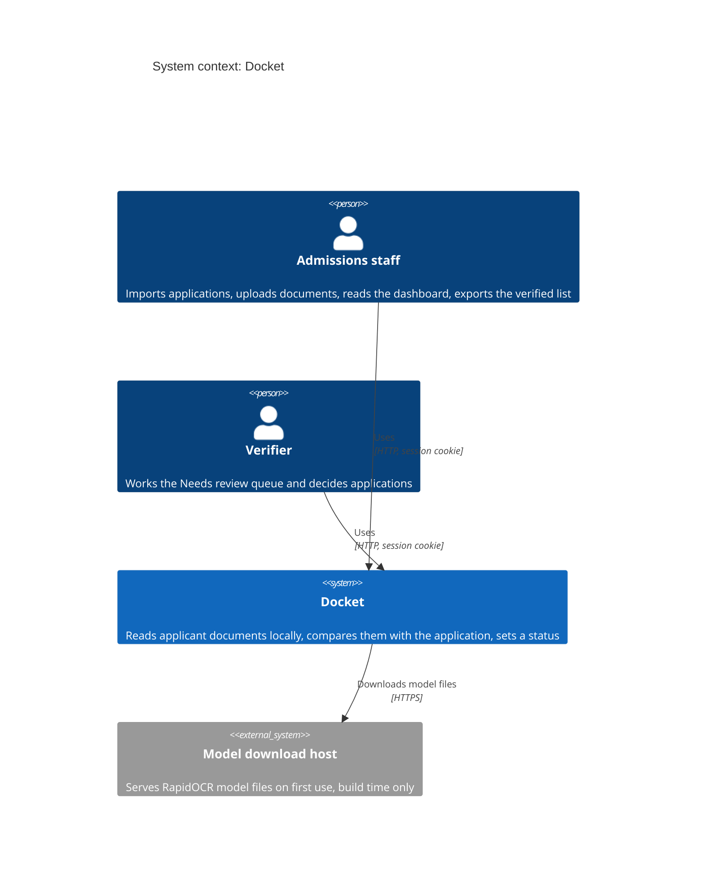
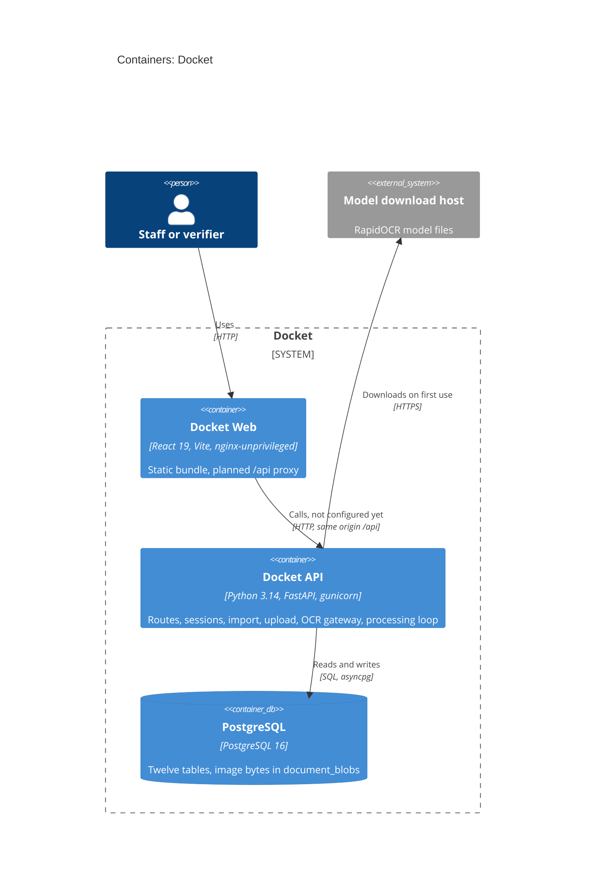
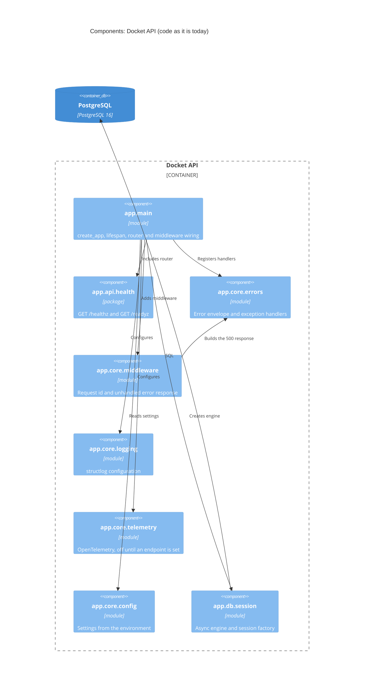
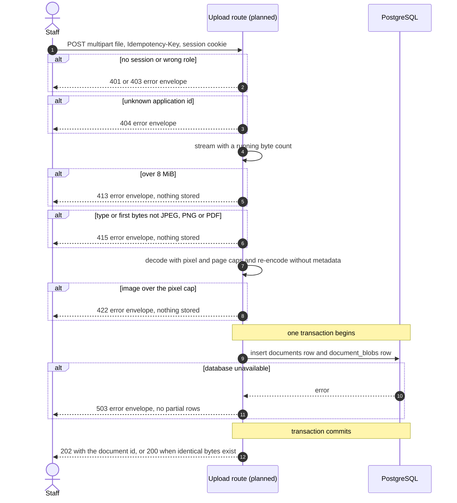
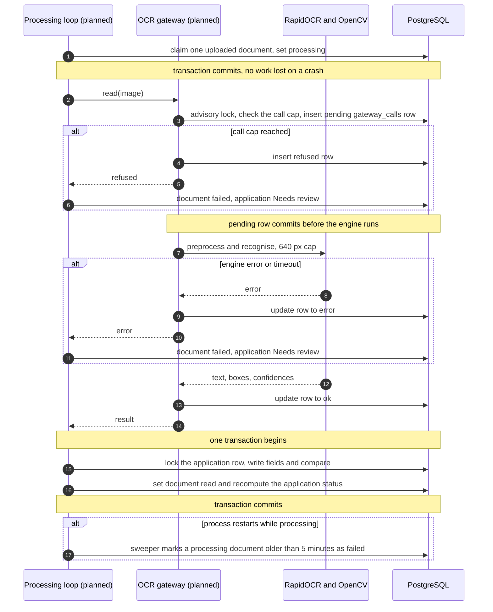

# Architecture: Docket

- Task: US-02-002
- Serves: REQ-001 to REQ-046, US-00-001 to US-00-011, US-02-001, ADR-0001, ADR-0004, ADR-0006, ADR-0007, ADR-0011
- Generated from the code and the design on 2026-10-05 by architecture-diagram (v1, new)
- Sources: compose `docker-compose.yml`, packages `app/`, `frontend/`, design `docs/design/docket-hld.md`
- Drawn: docs/architecture/diagrams/Docket_SystemArchitecture_v1.svg and Docket_ArchitectureFlow_v1.svg (written by `render.py`, not run in this session)

The code today is a scaffold: `app/main.py:58` mounts only the health router, `app/domain/` is empty, and `docker-compose.yml` runs only PostgreSQL. Everything else below is the design in the HLD, so every element or edge that no code backs is on the unconfirmed list and the sequences are design traces, not code traces.

## 1. Context

No runtime third party carries a document (ADR-0003, REQ-044). Roles come from `docs/security/AUTH.md` and the backlog personas (US-00-011), not from auth code, which does not exist.

## 2. Containers

Dev-only: none. `docker-compose.yml` has one service, `postgres`, which is drawn. The `api` and `web` containers are not in compose yet (story PS-11).

## 3. Components: Docket API

Skipped: `app/domain/` (empty), `app/db/base.py` and `app/db/models.py` (under 30 lines), `app/db/repositories/` (empty). The planned components (auth, import, upload, OCR gateway, processing loop, review) have no code and are not drawn here. They appear as modules of the Docket API node in `architecture.json`.

## 4. Sequences

Both flows are design traces from the HLD, data model and uploads plan. No handler exists to trace, so every participant is a planned component and the flow is unconfirmed.

### Upload a document (POST /api/applications/{id}/documents, US-00-002)

No external side effect happens before the commit, so there is no dual write on this path.

### Read a document (processing loop, US-02-001, US-00-003, US-00-005)

Failure left behind: if the process dies after the engine returns and before the last commit, the `pending` call row keeps counting toward the cap and the document is marked `failed` by the sweeper, so the application is Needs review and staff re-upload. Nothing outside the database holds state.

## 5. Legend

| Style | Meaning |
| --- | --- |
| Solid edge, container view | Backed by code or config: PostgreSQL in `docker-compose.yml:3` and `app/db/session.py`, the router include at `app/main.py:58` |
| "planned" or "not configured yet" in a label | Design only, listed under Unconfirmed |
| Skipped | `app/domain/` (empty), `app/db/base.py` and `app/db/models.py` (under 30 lines), `app/db/repositories/` (empty), test doubles, generated code |
| Dev-only | none |

## 6. Sources

| Element | File | Line |
| --- | --- | --- |
| PostgreSQL container | docker-compose.yml | 3 |
| Docket API image and port | Dockerfile | 18 |
| API entrypoint, `create_app` | app/main.py | 42 |
| Health router included | app/main.py | 58 |
| Middleware added | app/main.py | 56 |
| Exception handlers registered | app/main.py | 57 |
| Tracing configured | app/main.py | 59 |
| Database engine on startup | app/main.py | 31 |
| Docket Web image and port | frontend/Dockerfile | 16 |
| Docket Web nginx config | frontend/nginx.conf | 1 |
| Health routes | app/api/health/router.py | 34 |
| 500 response built | app/core/errors.py | 125 |

## 7. Unconfirmed

- web -> api (same-origin `/api`): the proxy block in `frontend/nginx.conf` is commented out and compose has no `api` service. Confirm with the backend lead rotation (story PS-11).
- api -> model download host: inferred from `docs/research/ocr-landscape.md` (RapidOCR downloads models on first use), no client code exists. Confirm with the platform rotation (story PS-08).
- Docket API container and Docket Web container in a running deployment: only Dockerfiles exist, not a compose service or a manifest.
- Planned components (auth, import, upload, OCR gateway, processing loop, review): no code, drawn from `docs/design/docket-hld.md`.
- Both sequences: design traces, no handler exists. Confirm when US-00-002 and US-02-001 are built.
- `Dockerfile:18` sets `WEB_CONCURRENCY=2`, but the design (ADR-0011, Proposed) draws one worker. The code and the design disagree; the code is not edited here.
