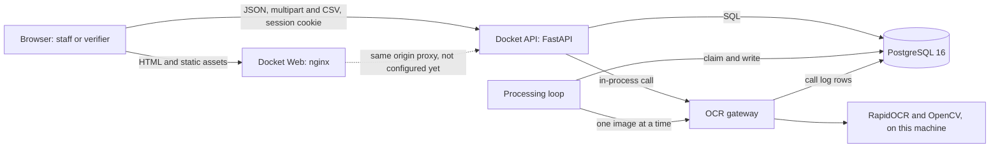

# High Level Design: Docket

- Task: US-02-002
- Author: draft, unreviewed. 2026-10-05. Version v1.
- Status: Draft (open conflicts and findings below keep it from Approved)
- PRD: docs/product/PRD.md
- ADRs: docs/architecture/decisions.md
- Tenets: docs/architecture/tenets.md
- Serves: REQ-001 to REQ-046, US-00-001 to US-00-011, US-02-001, US-02-002, US-02-003, US-02-004, ADR-0001 to ADR-0011

## Summary

One FastAPI service runs the whole backend, including the OCR gateway and the loop that reads each uploaded document, in a single process, backed by one PostgreSQL 16 database that also holds the document images, and served to one React frontend on the same origin. The engine is RapidOCR with OpenCV preprocessing, run locally with no outbound call (ADR-0001, ADR-0003); hosting is deferred until the engine fits at or below about 400 MB (ADR-0004), and real student data is not allowed until the DPIA conditions are met.

Diagram: docs/architecture/diagrams/Docket_SystemArchitecture_v1.svg (drawn by architecture-diagram from docs/architecture/architecture.json, not drawn yet: run `render.py`)

## What gets built

| Component | Kind | Stack | Responsibility | Repository |
| --- | --- | --- | --- | --- |
| Docket Web | frontend | React 19, TypeScript, Vite, TanStack Query and Router, served by unprivileged nginx | sign in, import, upload, the verifier queue, side-by-side review, dashboard, export | DocketWeb |
| Docket API | backend | Python 3.14, FastAPI, Pydantic v2, SQLAlchemy 2 async, Alembic, structlog, gunicorn with uvicorn workers | routes, sessions and roles, CSV import, upload, comparison, status, decisions, dashboard, export | DocketApi |
| OCR gateway | backend module | RapidOCR, ONNX Runtime, OpenCV (ADR-0001) | the one function that reads an image, logs every call and refuses past the cap | DocketApi |
| Processing loop | worker, in the API process | asyncio task and a thread per read (ADR-0011, Proposed) | claims uploaded documents one at a time, calls the gateway, writes fields and status | DocketApi |
| PostgreSQL 16 | data | postgres:16 image, one database | every table, including `document_blobs` and the append-only `decisions` log | none (a container image, `docker-compose.yml:3`) |

## 1. Goal and non-goals

Docket lets admissions staff import applications from a CSV, upload each applicant's scanned documents, and have a free open-source OCR engine read them and compare the fields with the application. Each application ends as Verified, Needs review or Missing documents, and verifiers decide the flagged ones, with every decision logged. It runs at zero cost on synthetic data only: no paid API, no card, and a local `docker compose` demo now, with hosting later when memory allows (ADR-0004).

Non-goals:

- Real student data. Synthetic only until the DPIA conditions are met.
- Any paid or third-party vision API, and any LLM fallback in v1 (ADR-0003).
- Hosted deployment in v1. The engine peaks near 509 MB, above the 512 MB free tier.
- Self sign-up, password reset, or any role beyond staff and verifier.
- Malware scanning of uploads in v1 (ADR-0009, Proposed).
- Multi-office or multi-tenant use.
- Handwriting and non-Latin scripts as a supported path (Devanagari is untested).

Section 1 was agreed on the strength of the instruction "do all not done" in the session; it was not re-confirmed with a separate "yes".

## 2. Users and flows

Actors: staff (imports, uploads, dashboard, export), verifier (queue and decisions), and the system (the processing loop). Roles and cells are in `docs/security/permission-matrix.md`.

**Flow A: staff load a batch (US-00-011, US-00-001, US-00-002)**

1. Staff sign in; the API sets the `docket_session` cookie (Docket API).
2. Staff upload the applications CSV; the importer reads it in one transaction with a savepoint per row and returns the counts and the refused rows with a row number, a column and a reason code, never the value.
3. For each application, staff upload a JPEG, PNG or PDF; the API streams it with an 8 MiB cap, checks type and first bytes, re-encodes it, stores the document row and its bytes in one transaction and answers 202.
4. The page polls the document list until each document is `read` or `failed`.

**Flow B: the system reads a document (US-02-001, US-00-003, US-00-004, US-00-005)**

1. The processing loop claims one `uploaded` document and marks it `processing`.
2. It calls the OCR gateway, which logs a `pending` call row, runs preprocessing and the engine, and updates the row to `ok` or `error`.
3. Rules and validators turn the text into typed fields with a confidence; each field is compared with the application value.
4. In one transaction the document becomes `read` or `failed` and the application status is recomputed: Needs review wins, then Missing documents, then Verified.

**Flow C: a verifier decides (US-00-006, US-00-007)**

1. The verifier opens the queue (status Needs review, not rejected).
2. The verifier opens an application and sees each document image beside the application value, field by field, with the failed fields marked.
3. The verifier approves, corrects a field value or rejects with a reason; the decision is inserted into the append-only log and the status is recomputed in the same transaction. Staff then see the new counts and can export the Verified list (US-00-008, US-00-009).

## 3. Architecture

**Docket Web** (owner: frontend lead rotation, assumption: the PRD names no owner). Static bundle behind unprivileged nginx on 8080 (`frontend/Dockerfile:16`, `frontend/nginx.conf`). It talks to the API with `fetch` over the same origin. The `/api/` proxy block in `frontend/nginx.conf` is commented out, so today the browser cannot reach the API through nginx: a gap, closed by PS-11.

**Docket API** (owner: backend lead rotation). One FastAPI app built by `create_app` (`app/main.py:42`); today it mounts only the health router (`app/main.py:58`). Planned: an authenticated API router with the dependency on the router, so a route is protected by default (`docs/security/AUTH.md`), the import, application, document, decision, dashboard and export routers, and services that own transactions and repositories that own SQL (`.claude/rules/python.md`). The error envelope is in place (`app/core/errors.py`). It talks to Postgres through asyncpg (`app/db/session.py`).

**OCR gateway** (owner: backend lead rotation, US-02-001). One function in front of the engine. It owns the call cap, the call log and the swap of engines by configuration, and a test fails if any other module imports an engine client (AC-US-02-001-1). It runs RapidOCR and OpenCV in process; no outbound request carries a document (AC-US-02-001-6).

**Processing loop** (owner: backend lead rotation). One asyncio task started from the lifespan in `app/main.py`, claiming with `UPDATE ... WHERE status = 'uploaded'` and `FOR UPDATE SKIP LOCKED`, one document at a time, each read in a thread so the event loop stays free (ADR-0011, Proposed). A sweeper marks a `processing` document older than 5 minutes as `failed` with reason `interrupted`, and a `pending` gateway call as `error`.

**PostgreSQL** (owner: platform rotation). One database, ten tables, schema in `docs/design/schema.sql`. It is the only store and the only queue: the claim query is the work queue, so there is no broker (catalogue default for messaging).

**Risks this leaves open**

- The API and the engine share one process and one memory budget; an engine fault or an out-of-memory kill takes the API down with it, and the API plus engine total has never been measured (509 MB is the benchmark process alone).
- The `/api/` same-origin path is not wired in nginx or compose, so the cookie session (ADR-0006) has not been exercised end to end.
- The processing loop is a background task inside a web worker: if `WEB_CONCURRENCY` stays at 2 (`Dockerfile:18`), two engines load. ADR-0011 proposes 1; it is not accepted.

## 4. Data

One database, PostgreSQL 16, with twelve tables: users, sessions, idempotency_keys, export_audit, imports, import_row_errors, applications, documents, document_blobs, extracted_fields, gateway_calls, decisions. The full model, constraints, indexes and processing rules are in `docs/design/data-model.md`, with `docs/design/schema.sql` as the only DDL. The store is the one already in `docker-compose.yml` and `app/db/session.py`; the image storage is ADR-0007; no analytics store is chosen (section 11).

| Entity | Owner | PII | Volume (July intake, estimate) | Retention |
| --- | --- | --- | --- | --- |
| applications | applications module | yes, minors, includes a community category | 5,000 | UNDEFINED |
| documents and document_blobs | documents module | yes | about 15,000 (3 per application) | UNDEFINED |
| extracted_fields | extraction module | yes | about 120,000 | UNDEFINED |
| decisions | review module | yes (reason text) | at least 600 (12% of 5,000) | UNDEFINED, never deleted by the app |
| gateway_calls | OCR gateway | no | at least 15,000, more with retries | UNDEFINED |
| users and sessions | auth module | yes (usernames) | tens | sessions: 8 h absolute, 30 min idle (assumed) |

Migrations the design implies: 0002 for the core schema (`docs/design/schema.sql`) and 0003 for roles, the `erase_application` function and `MIGRATION_DATABASE_URL`, after `0001_init` (`schema_probe`). Erasure is in place, never a delete, because the decision log must survive (data model sections 8 and 9).

**Risks this leaves open**

- Every retention period is UNDEFINED, so nothing may run on a schedule and real data cannot be loaded (DPIA).
- Images in Postgres: the 1 GB Neon free tier and the ADR-0007 trigger (500 documents or 1 GB) bound the hosted variant to a demo size; the re-encoded size per image is unmeasured.
- No story owns `erase_application` yet (PS-10), so the erasure promise in the DPIA has no delivery date.
- Backups and restore are UNDEFINED: nothing says how the local volume (`pgdata`) is backed up.

## 5. Interfaces

- REST API, 16 operations (14 plus `reprocessDocument` and `listDecisions` added after the critic review), `api/openapi.yaml` (new, a design, only the two health routes exist in code). Style, deviations and the error table: `docs/api/README.md`, `docs/api/API.md` (generated, not yet run).
- Multipart upload and a CSV download are part of the same contract.
- The OCR gateway interface is an in-process function, not a network API; its contract is to be written under US-02-001 as the function signature and the `gateway_calls` row shape (`docs/design/schema.sql`).
- No events, queues or webhooks: the claim query is the queue.
- The storage interface for `document_blobs` (ADR-0007) is an in-process boundary to be defined in `app/`.

## 6. External integrations

None on the runtime path. Documents never leave the machine (REQ-044, ADR-0001, ADR-0003). Two build-time dependencies exist:

- **Model download host.** RapidOCR fetches its model files on first use (`docs/research/ocr-landscape.md`). If the host is down or slow, the first processed document fails until the files are present; a tampered download changes results (T-26). Mitigation planned: PS-08 pins, checksums and bakes the models into the image, so the running service never downloads. Credential: none.
- **Package registries** (PyPI, npm). Down: a build fails, nothing running changes. Lockfiles `uv.lock` and `pnpm-lock.yaml` pin versions (`Dockerfile:7`, `frontend/Dockerfile:7`), and `make vuln` audits them (`Makefile:73`).

Provider facts for the future hosted variant (Render, Neon, Cloudflare Pages) are cited in `docs/research/free-hosting.md`; none is on today's path, and the RAM figure for Render free is unverified there.

### Deliberately not integrated

- Paid or hosted vision or LLM APIs: constraint zero cost and no real data to a third party (CONSTRAINTS.md, ADR-0003).
- Object storage: not needed for the demo size (ADR-0007).
- Hosted identity provider (the catalogue default): the demo has two seeded roles and a session must be revocable at once (ADR-0006).
- Malware scanner: does not fit 512 MB (ADR-0009, Proposed).
- Crash reporting or analytics SDKs: they could capture minors' data from the review screen (DPIA).
- Email or SMS: no story asks for a notification.

**Risks this leaves open**

- First-run model download is not yet blocked; until PS-08 lands, a fresh container needs network access and trusts the model host.

## 7. Failure modes

| Component | What fails | How it is noticed | What the user sees | How it recovers |
| --- | --- | --- | --- | --- |
| Docket Web | nginx down or the `/api/` proxy missing | container healthcheck `/healthz` (`frontend/Dockerfile:20`) | blank page or network errors | restart the container, wire the proxy (PS-11) |
| Docket API | unhandled exception | structured error log with request id (`app/core/errors.py:125`) | 500 envelope with `request_id` | fix and redeploy, the request is retried by the user |
| Docket API | process killed for memory | UNDEFINED (no alert exists) | every request fails until restart | restart policy in compose is UNDEFINED |
| Session and roles | stolen cookie, expired session | 401, `sessions.last_seen_at` | redirect to sign in | sign in again, revoke by `session_version` |
| Import | malformed or duplicate rows | per-row reason codes in the response | refused rows listed, valid rows created | fix the CSV and re-import (duplicate ref is refused, not overwritten) |
| Upload route | oversize, wrong type, client disconnect | 413 and 415 envelopes, no row written | message naming the accepted formats | upload again, nothing was stored |
| Processing loop | crash, restart or a read that hangs | sweeper finds `processing` older than 5 minutes (the read timeout is UNDEFINED, see section 16) | document `failed`, application Needs review | a reprocess operation (proposed, not built, section 16) or a new upload with different bytes: identical bytes return the existing document, so a plain re-upload does not recover. A late result cannot overwrite the sweeper because the completion write checks `status = 'processing'` |
| OCR gateway | engine error, timeout or call cap reached | `gateway_calls` outcome `error` or `refused` | Needs review with the reason | verifier decides, or the cap is raised by configuration |
| OCR engine | out of memory on a large image or after many pages | process killed, UNDEFINED alert | API unavailable | restart, pixel caps (PS-04) reduce the risk, growth past 30 pages is unmeasured |
| PostgreSQL | down or full | `/readyz` returns 503 (`app/api/health/router.py:40`) | 503 envelope | restart or free space, nothing is half written because rows commit together |
| Decision service | a verifier submits twice, or two verifiers decide | a retry with the same `Idempotency-Key` and body replays the first result (`idempotency_keys`), a different body under the key is 409, and a decision on an application no longer in Needs review is 409 (row lock, data model rule 3) | the second verifier sees a conflict message and the current status | the log keeps the first decision, the second verifier reopens the application |
| Export | a name starting with `=` opens as a formula | none until PS-06 | spreadsheet runs the formula | PS-06 prefixes such cells |

Check then act: the rule "Verified only when all fields match or a verifier decided" (REQ-019) is checked inside the status transaction that holds `FOR UPDATE` on the application row (data model processing rule 1), not at enqueue time. Side effect then record: the only external side effect is none (no third party), so the dual write case does not arise. Retries: a failed read is not retried; staff re-upload or a verifier decides, so there is no retry loop to bound.

## 8. Scaling and limits

Expected load, July intake estimate from the PRD: 5,000 applications, about 15,000 documents, 12% flagged, so about 600 for verifiers.

- Processing: 1.42 s per page measured on a multi-core laptop (`docs/research/ocr-benchmark.md`), so 3600 / 1.42 = about 2,535 documents per hour and 15,000 / 2,535 = about 5.9 hours of compute for the whole intake. The demo set of 30 documents is about 43 seconds. Single-core speed is unmeasured and may be several times slower.
- Worst window: assumption: staff upload all 15,000 documents in one 8 hour day, 1,875 per hour. That is under the 2,535 per hour ceiling at benchmark speed, so the queue stays near empty. On a host half as fast the ceiling is about 1,268 per hour, the backlog grows by 607 per hour (1,875 minus 1,268), reaches about 4,856 after 8 hours and takes about 3.8 hours more to clear (4,856 divided by 1,268). Upload decode and re-encode (ADR-0010), the PDF rasteriser and one argon2id hash (64 MiB) run in the same process outside the one-document bound, so uploads are limited to two at a time by a semaphore and counted in the memory budget.
- Python version: the 509 MB and 1.42 s figures were measured in a Python 3.12 environment (`scripts/run-ocr-benchmark.sh:8`, `evals/requirements-ocr.txt`), but the API is pinned to Python 3.14 (`pyproject.toml:6`). Wheels for RapidOCR, ONNX Runtime and OpenCV on 3.14 have not been checked (DEBT-006), so every number in this section is for 3.12 until the engine is installed and measured inside the API on 3.14 (section 16, BLOCKER).
- Memory is the first bottleneck, not throughput: about 509 MB peak (five repeats, 508.5 to 509.5), 365 MB after one page, against 512 MB. Headroom is 3 MB, so the design as measured stops working on a 512 MB host (ADR-0004). One login hash at argon2id 64 MiB would add to that, so concurrent hashes are limited to one (T-06).
- Process model: `WEB_CONCURRENCY=2` (`Dockerfile:18`) would load the engine in each worker, about 1,018 MB for the engines alone (2 x 509), a limit enforced per process and multiplied by the process count. ADR-0011 sets it to 1.
- Database: 5,000 applications scan in milliseconds for the dashboard; the queue uses a partial index (`idx_applications_review_queue`); about 120,000 field rows is small. Image bytes are the growth: 15,000 documents at 3 MB is 4.5 x 10^10 bytes, which is 45 GB (the ADR-0007 estimate for an original phone photo, before re-encoding), against a 1 GB free tier. At 3 MB, 1 GB holds about 333 documents; the ADR-0007 trigger of 500 documents assumes about 2 MB each, and the demo set (5 MB for 30 documents, about 170 KB each) would allow about 6,000. The stored size after re-encoding at 2,000 pixels is unmeasured, so the trigger is to be recomputed after one measured photo.
- Where it stops: a 512 MB host, the free-tier database once the re-encoded images pass 1 GB (between about 333 and about 6,000 documents, depending on that measurement), and a single core more than three times slower than the benchmark, where the ceiling falls to about 845 documents per hour (2,535 divided by 3), below the 1,875 per hour worst window.

**Risks this leaves open**

- Single-core speed, memory growth past 30 pages, Devanagari and real photos are unmeasured and could flip ADR-0001.
- The 12% routing target rests on a provisional cutoff of 0.9804 (ADR-0005); the verifier workload could be larger.
- The upload caps (8 MiB, 2,000 pixels) are assumptions the product owner has not confirmed.

## 9. Security and privacy

- **Authentication:** server-side cookie session, 256-bit opaque token, only its SHA-256 stored, `HttpOnly; Secure; SameSite=Lax`, 30 minute idle and 8 hour absolute lifetimes (assumptions), argon2id passwords, seeded accounts only (ADR-0006, `docs/security/AUTH.md`). This is design only; no auth code exists, and no route is protected today because the only routes are health.
- **Authorisation:** RBAC with staff and verifier, per route and per action, not per record, because the office is one tenant and any signed-in user may read any applicant (threat T-25). A role denial is 403, an unknown id 404, a missing session 401. The 33 matrix cells are reserved tests (`docs/security/permission-matrix.md`).
- **Untrusted content:** names from CSV and text read from images are rendered as text by React, never as markup; stored images are re-encoded and served with a fixed content type, `Cache-Control: private, no-store` and `nosniff`; the CSP allows scripts from `self` only (`frontend/nginx.conf`). Staff and verifier sessions share the origin with these pages, so a script that got in could use a session; the CSP and text rendering are the only barriers.
- **Model output on a public path:** not applicable: there is no LLM and no public path (ADR-0003).
- **PII:** minors' names, dates of birth, roll numbers, marks, a community category and document images (`docs/privacy/DATA_MAP.md`, 16 elements, all retention UNDEFINED). The DPIA is Proposed and unsigned (`docs/privacy/DPIA-admissions-verification.md`).
- **Secrets:** `DATABASE_URL`, `MIGRATION_DATABASE_URL` (to be added, blocks migration 0003), from the environment; `.env.example` documents them; nothing is committed.
- **Threats:** 30 threats, 4 mitigated, 26 planned, 9 new stories (`docs/security/threat-model-docket.md`, `docs/product/proposed-stories.md`).

**Risks this leaves open**

- Everything beyond the health routes is unauthenticated today; until US-00-011 and PS-01 to PS-03 land, no real route may be exposed beyond localhost.
- CSRF has no mechanism chosen (T-03); `SameSite=Lax` alone is not enough if the API is ever on another origin.
- No malware scan (ADR-0009): a crafted file can reach OpenCV, ONNX Runtime and the PDF rasteriser.
- Erasure and retention are undecided, so the privacy promises are unproven.

## 10. Observability

- **Logs:** structlog, JSON in production, request id bound by `RequestIdMiddleware` (`app/core/middleware.py`); the unhandled-error log carries the error class and frames, never the message (`app/core/errors.py:125`). Log lines follow the current stdout (`app/core/logging.py`).
- **Traces:** OpenTelemetry, on only when `OTEL_EXPORTER_OTLP_ENDPOINT` is set (`.env.example:8`, `app/core/telemetry.py`).
- **Metrics:** none exported today. The first source is the `gateway_calls` table (latency, outcome, units), then request rate, errors and duration.
- **Health:** `/healthz` and `/readyz` exist (`app/api/health/router.py:34`, `:40`).
- **Alerts proposed, not enabled until their runbooks exist (`.claude/rules/observability.md`):** `ApiMemoryHigh` (resident memory over 95% of the container limit for 2 minutes, because the loaded engine sits at about 509 MB steady state, so a lower fixed threshold would fire permanently), runbook `docs/runbooks/api-memory.md`; `ProcessingBacklog` (documents in `uploaded` over 200 for 15 minutes), runbook `docs/runbooks/processing-backlog.md`; `GatewayCapNear` (calls at 90% of the cap), runbook `docs/runbooks/gateway-cap.md`; `ApiErrorRateHigh` (5xx over 2% for 5 minutes), runbook `docs/runbooks/api-errors.md`. No runbook is written yet.

**Risks this leaves open**

- No metrics or alerting stack exists, and the local demo has none; an out-of-memory kill is invisible today.
- A log line could carry a personal value; PS-05 adds the test that proves it does not.

## 11. Analytics

No analytics store and no product events: analytics is out of scope (`docs/decisions.md`), so no "analytics store" ADR is needed. The business questions are answered from the operational tables, kept apart from the audit trail (`decisions`, `gateway_calls`).

| Question | Source |
| --- | --- |
| How far has verification got? | `GROUP BY status` on `applications` (US-00-008), a live count |
| How many applications need a person? | the review queue query, compared with the 12% target in ADR-0005 |
| How accurate is the engine? | the eval report from `evals/` on synthetic data (US-02-004), not from production rows |
| How many engine calls were used? | `gateway_calls`, which is also the cap counter |
| Who decided what? | `decisions`, the audit trail, not an analytics source |

**Risks this leaves open**

- There is no measure of real-world accuracy once real documents exist; the eval is on synthetic pages only.

## 12. Rollout and rollback

Phases, each with a way back. There is no production yet, only a local demo.

1. **Schema (migration 0002).** Apply `docs/design/schema.sql` after `0001_init`. Back out with `make migrate-down`; the tables are empty, so nothing is lost. Work in flight: none.
2. **Roles and erase function (migration 0003).** Needs `MIGRATION_DATABASE_URL`. Back out with the down migration; the API role loses nothing it had.
3. **Auth and the import and upload routes.** Ship in story order with the matrix tests. Back out by reverting the commit; sessions and users are dropped by the down migration, rows in `applications` stay and are inert.
4. **Processing loop.** A proposed setting `PROCESSING_ENABLED` (a new variable, not in `.env.example` yet) is the kill switch, operator owned and separate from any user setting. Off: uploaded documents stay `uploaded` and nothing reads them. On: the loop claims them in order. A document `processing` at a restart is marked `failed` by the sweeper going forward; going back, those documents stay `failed` until re-uploaded.
5. **Compose demo.** Add the API and frontend services and the nginx proxy (PS-11). Back out by removing the services; the database volume is untouched.
6. **Hosted variant, later.** Only when the engine fits at or below about 400 MB (ADR-0004). Back out by returning to the local compose demo; the data moves with `pg_dump`, a step not yet written.

The call cap is a configured value (US-02-001). A call refused at the cap marks the document `failed` with reason `cap_reached` (the same in `docs/design/uploads-pattern.md` and the C4 sequence), so lowering the cap to zero is not a pause: it fails every queued document permanently, and raising it later reprocesses nothing until a reprocess operation exists. `PROCESSING_ENABLED` is the only pause.

**Risks this leaves open**

- Down migrations on a database with real rows lose data; the plan assumes the demo is rebuilt from the seed.
- Nothing proves the 0003 role change works without `MIGRATION_DATABASE_URL`, which does not exist yet.

## 13. Outside the standard stack

- RapidOCR, ONNX Runtime and OpenCV preprocessing (vision approach, ADR-0001, ADR-0002): the catalogue default is a VLM or a trained model; sign-off from the Architect or Engineering Manager pending.
- Own cookie sessions with argon2id passwords and seeded accounts (auth, ADR-0006): the catalogue default is a hosted identity provider; sign-off pending.
- Local `docker compose`, no managed containers (compute, ADR-0004): sign-off pending.
- Image bytes in a Postgres table (database, ADR-0007): the catalogue default is the cloud's object store; sign-off pending.
- `python-multipart`, `pdf2image` with poppler and OpenCV as a runtime dependency (ADR-0008, ADR-0010, Proposed): not in `pyproject.toml` (OpenCV is only a dev dependency); sign-off pending and a `dependency-audit` run is needed first.
- `rapidocr` and `onnxruntime` as runtime dependencies of the API (ADR-0001): in `evals/requirements-ocr.txt` only, unpinned, not in `pyproject.toml`. PyPI shows 3.14 wheels for onnxruntime 1.30.0, pyclipper 1.4.0, Shapely 2.1.2 and a stable-ABI opencv-python-headless, and rapidocr 3.9.2 is pure Python (section 16), but no install was run on 3.14. rapidocr depends on `opencv_python` (the non-headless build), which needs the system library `libGL` in the slim image (assumption). Sign-off pending.
- An argon2id library (ADR-0006): not chosen and not in `pyproject.toml`; to be recorded when US-00-011 is built, sign-off pending.
- No Sentry and no Grafana stack (observability): the catalogue default is OpenTelemetry with Grafana plus Sentry; only OpenTelemetry is wired, sign-off pending.

## 14. Repository plan

| Repository | Path | Stack id | Responsibility | Apps |
| --- | --- | --- | --- | --- |
| DocketApi | Docket/Server/DocketApi | python-api | the one backend service and the OCR gateway; owns the database | none |
| DocketWeb | Docket/Client/DocketWeb | react-web | the staff and verifier screens | none |

Both live in the repository that holds these documents today (`app/` and `frontend/`), so `docs/architecture/repo-plan.json` carries a `path` for each and `new-repo` creates nothing. Whether `frontend/` stays in this repository is an open question (section 17).

## 15. Decisions and conflicts

11 ADRs indexed, 8 conflicts found (5 Proposed, 3 open), 0 settled by a person in this run. Register: `docs/architecture/decisions.md`. ADRs 0008 to 0011 are Proposed and await the engineer. ADR needed: none beyond those; the CSRF mechanism and the argon2id library are to be chosen and recorded when PS-02 and US-00-011 are built.

## 16. What the review found

Reviewed by: critic, 2026-10-05 (two runs; the first run's report arrived after the second and its extra findings are at the end of this section). Findings are recorded as the critic gave them, shortened. I checked the Python version claim against `pyproject.toml:6` and `scripts/run-ocr-benchmark.sh:8` and the missing idempotency table against `docs/design/schema.sql`; the other findings were not independently re-verified. The critic confirmed every cited file and line in the HLD.

### BLOCKER: The engine has never been installed or measured on the interpreter it will run in

The HLD puts RapidOCR and ONNX Runtime inside the API process (ADR-0011). The API is pinned to Python 3.14 (`pyproject.toml:6`), but the benchmark that produced 509 MB and 1.42 s per page ran in a separate Python 3.12 environment (`scripts/run-ocr-benchmark.sh:8`), because cp314 wheels were not checked (DEBT-006). If any of the three libraries has no cp314 wheel, the in-process layout cannot be built, and even if all install, sections 8 and 9 carry 3.12 numbers.

Conflicts with: ADR-0011, ADR-0001, ADR-0004, sections 3 and 8, DEBT-006.

Fix: run `uv pip install --dry-run --python 3.14 rapidocr onnxruntime opencv-python-headless`. If it fails, write an ADR choosing a 3.12 or 3.13 API or a separate worker image, which overturns ADR-0011. If it resolves, re-measure peak RSS and seconds per page under 3.14 inside the API and cite the run in section 8.

Status: partly resolved, still open. Checked on 2026-10-05 against the PyPI per-release JSON (`https://pypi.org/pypi/<package>/<version>/json`, file names quoted verbatim by the fetch tool; a summarising fetch of the project-wide pages was unreliable and is not used):

| Package | Release | Linux x86_64 wheel for CPython 3.14 |
| --- | --- | --- |
| onnxruntime | 1.30.0 | yes: `onnxruntime-1.30.0-cp314-cp314-manylinux_2_28_x86_64.whl` |
| pyclipper | 1.4.0 | yes: `pyclipper-1.4.0-cp314-cp314-manylinux2014_x86_64.manylinux_2_17_x86_64.whl` |
| Shapely | 2.1.2 | yes: `shapely-2.1.2-cp314-cp314-manylinux_2_17_x86_64.manylinux2014_x86_64.whl` |
| opencv-python-headless | 5.0.0.93 | yes, stable ABI: `opencv_python_headless-5.0.0.93-cp37-abi3-manylinux_2_28_x86_64.whl`; the repository's dev group already installs it on 3.14 (the seed and noise tests pass in `make check`) |
| rapidocr | 3.9.2 | pure Python: `rapidocr-3.9.2-py3-none-any.whl`, `requires_python <4,>=3.8` |

So the native libraries have 3.14 wheels. The dry run was then run by the engineer (`uv pip install --dry-run --python 3.14 rapidocr onnxruntime opencv-python-headless`): it resolved 22 packages in 0.7 s and would install 13, with these versions: rapidocr 3.9.2, onnxruntime 1.30.0, opencv-python 5.0.0.93, pyclipper 1.4.0, shapely 2.1.2, omegaconf 2.3.1, antlr4-python3-runtime 4.9.3, flatbuffers 25.12.19, colorlog 6.12.0, requests 2.34.2, charset-normalizer 3.5.2, six 1.17.0, tqdm 4.70.1. So resolution on 3.14 is proven. A dry run does not build or import anything: `antlr4-python3-runtime` 4.9.3 is a source package (not checked: it builds at install time), and the resolver pulled in `opencv-python` (the non-headless build) beside the headless one, two packages that both provide the `cv2` module (a known conflict, to be settled by installing rapidocr with its OpenCV dependency removed or by using the non-headless build alone). What stays open: (1) a real install and an import of the engine on 3.14, which the benchmark rerun will show; (2) rapidocr requires `opencv_python`, not the headless build (PyPI `requires_dist`), which imports `libGL` and is likely to fail in `python:3.14-slim` unless a system package is added (assumption, not run; recorded in section 13); (3) every number in section 8 is still a 3.12 measurement, and `evals/requirements-ocr.txt` leaves `rapidocr` and `onnxruntime` unpinned, so the measured versions are not recorded. Section 8 keeps saying every number is for 3.12. The BLOCKER closes when the dry run passes and the benchmark is repeated under 3.14 with versions recorded.

### BLOCKER: Idempotency-Key is required by the contract and stored nowhere

`api/openapi.yaml` requires `Idempotency-Key` on createImport, uploadDocument and createDecision and promises a replay for 24 hours, but `schema.sql` had no table for the key, the body hash or the result. "Made once per attempt" also defeated the purpose, since a retry carries a new key. The sha256 check on uploads is check then act with no unique index, so two identical concurrent uploads could both insert.

Conflicts with: `api/openapi.yaml`, `docs/design/schema.sql`, section 7, `docs/architecture/docket-c4.md`.

Fix: add an `idempotency_keys` table, reword the header to "once per logical operation, reused on retry", and correct section 7.

Status: fixed (`docs/design/schema.sql` new table with primary key `(user_id, key)`, `data-dictionary.csv`, `erd.md`, `data-model.md` headline now 11 tables, 102 columns, 18 indexes, `api/openapi.yaml` header description, section 7). The sweeper that deletes keys older than 24 hours and the migration are build items. `model_check.py` and `apply_check.sh` have not been run on the new table.

### MAJOR: Approve cannot produce Verified under the written status rule

AC-US-00-007-1 says approve makes the application Verified, but data model processing rule 3 read only documents and field flags, never decisions, so an approve left a failed document or flagged field in Needs review. A later upload could revert or leave a stale approval. The decision service had no row lock or status check, so two verifiers or a stale screen both succeeded.

Conflicts with: `docs/design/data-model.md` rule 3, tenet 2, AC-US-00-007-1, AC-US-00-008-2, Flow C.

Fix: make the decision an input to rule 3, lock the application row, and refuse with 409 unless the status is Needs review and not rejected.

Status: fixed (`docs/design/data-model.md` rule 3, section 7 Decision service row, tenet 2 below).

### MAJOR: The only recovery path, re-upload, does not recover

Identical bytes return the existing failed document. A failed document has `detected_type` NULL, so rule 1 never clears it and rule 3 keeps the application in Needs review after a good re-upload. Lowering the cap to zero permanently fails queued documents. The three design documents disagreed on what happens at the cap, and a document left `uploaded` would be re-claimed and logged as refused without end.

Conflicts with: sections 7 and 12, `api/openapi.yaml` uploadDocument, data model rules 1 and 3, `docs/design/uploads-pattern.md`, `docs/architecture/docket-c4.md`.

Fix: add a reprocess operation, exclude failed documents from the sha256 check, make rule 3 ignore a superseded failed document, name `PROCESSING_ENABLED` as the only pause, and settle cap_reached as failed everywhere.

Status: fixed for the reprocess operation (`reprocessDocument` in `api/openapi.yaml`, a failed document becomes uploaded with a new gateway call row) and the dedup exclusion (`uploads-pattern.md`). open: the story for the reprocess operation (PS-12 in `docs/product/proposed-stories.md`) and its screen control on S-05 (flows question 6). Also fixed: rule 3 ignores a superseded failed document, `PROCESSING_ENABLED` is the only pause and cap_reached is `failed` in section 12, `uploads-pattern.md` and the C4 sequence.

### MAJOR: A read that hangs has no stop, and its late result overwrites the sweeper

Each read runs in a thread, which cannot be cancelled, and no timeout value is stated. After 5 minutes the sweeper marks the document failed, but the thread keeps running and its completion can set `read` over `failed`. If the loop moves on, two engine runs overlap on a 3 MB headroom, and if it waits, the queue stalls silently.

Conflicts with: ADR-0011, sections 3, 7 and 8, `uploads-pattern.md`, PS-04.

Fix: guard the completion with `WHERE status = 'processing'` plus a claim token, run the engine in a killable child process or do not claim again until the thread exits, and state the timeout number.

Status: fixed in ADR-0011 (still Proposed): a long-lived child process the loop can kill, a 120 second timeout below the 5 minute sweeper age, a recycle after 500 documents, and no claim token (the status check is enough). The late overwrite is guarded in `data-model.md` rule 1. open: the numbers are proposals, and the 500 document recycle waits on the memory-growth measurement.

### MINOR: The memory budget leaves things out, and the alert threshold sits below steady state

Upload decode, poppler and one argon2id hash run in the same process outside the one-document bound, and `ApiMemoryHigh` at 450 MB would fire permanently once the engine reaches 509 MB.

Fix: bound concurrent uploads and set the alert above steady state.

Status: fixed (section 8 semaphore of two uploads, section 10 alert at 95% of the container limit). The semaphore size is an assumption.

### MINOR: The numbers disagree with each other

"About 170 documents per hour" for a core three times slower should be 845 (2,535 divided by 3). "About 500 documents" on 1 GB assumed 2 MB each while 3 MB gives 333, and 45 GB is the size before re-encoding. "About 25 percent of an hour" was not a quantity.

Fix: one stored-size figure from a measured photo, and recompute.

Status: fixed in section 8 (recomputed, with the range 333 to 6,000 documents). open: the stored size after re-encoding still needs one measured photo, and ADR-0007's trigger of 500 documents needs recomputing.

### MINOR: Two stories and two hardening items have nowhere to live

AC-US-00-007-5 says staff and verifiers read the decision log, but `api/openapi.yaml` has no GET for decisions and ApplicationDetail has no decisions array. "Every export writes an audit entry" (PS-07) has no table. PS-01 lockout has no store for its counters.

Fix: add the endpoint, an append-only `export_audit` table and a stated store for login counters.

Status: fixed. `listDecisions` is in `api/openapi.yaml`, `export_audit` is in `schema.sql` (data model now 12 tables, 106 columns, 20 indexes), and login counters are kept in the one API process and reset on a restart, which is acceptable because ADR-0011 runs one worker (an accepted limit: a restart clears a lockout). `model_check.py` and `apply_check.sh` have not been run on the new tables.

### MINOR: The login rate limit per source will lock out the whole office behind nginx

In compose the API sees the nginx container as the client address. gunicorn trusts X-Forwarded-For only from 127.0.0.1 by default, and the commented proxy block (`frontend/nginx.conf`) does not set X-Real-IP, so "five failures in a minute from one source" would apply to everyone at once.

Fix: set `--forwarded-allow-ips` to the nginx address and key the limit on account plus the forwarded source.

Status: fixed in `docs/product/proposed-stories.md` PS-01 (limit keyed on account plus forwarded source, `--forwarded-allow-ips` set to the nginx address) and PS-11 (nginx proxy sets the forwarded headers). Build items.

### MINOR: Tenet 1's import test collides with ADR-0010

The architecture test failed any import of OpenCV outside the gateway, but the upload route re-encodes with OpenCV.

Fix: name `rapidocr` and `onnxruntime` only.

Status: fixed (`docs/architecture/tenets.md` tenet 1).

### NIT: Section 7 said 409 for a double submit while the contract replays a same-body retry

Status: fixed (section 7 Decision service row).

Not a finding, per the critic: one process, one Postgres and no backup are single points of failure; they are named and acceptable for a synthetic local demo.

### From the first critic run: findings the second run did not raise

**MAJOR: The 509 MB peak is a 30-page figure for a process that must read 15,000 pages.** Memory is 365 MB after one page and 509 MB after 30, growth beyond that is unmeasured, and nothing recycles the long-lived worker (`gunicorn --max-requests` does not touch a background task, `Dockerfile:25`). If memory grows by about 5 MB per page the process dies long before 15,000 pages, and ADR-0001's own trigger is 450 MB at 1,000 pages. Fix: record RSS every 50 pages over 1,000 pages with the benchmark harness, and if it grows add an engine reload or process recycle every N documents to ADR-0011. Status: open.

**MAJOR: The decision on a stale screen is not covered by a row lock alone.** The lock serialises two decisions, but a verifier who opened an application before new evidence arrived can still decide on stale data while the status is still Needs review. Fix: an `applications.updated_at` precondition (`If-Match`) on createDecision and a 409. Status: fixed. `api/openapi.yaml` now sends an `ETag` on getApplication and requires `If-Match` on createDecision, and the row lock and Needs review check are in `data-model.md` rule 3. No schema change: the ETag is `updated_at`.

**MINOR: Recovery mechanisms have no owner and the argon2 limit has no mechanism.** The sweeper (stale `processing` documents, `pending` calls, expired sessions and idempotency keys) is owned by no story (`data-model.md` section 12). "Concurrent hashes limited to one" is not in PS-01, which only sets a rate limit, and a 64 MiB hash on top of a 509 MB peak exceeds 512 MB even at one. Section 13 omitted RapidOCR, ONNX Runtime and an argon2 library. Fix: add the sweeper to a story, add "hash under a semaphore of one, in a thread" to PS-01, complete section 13. Status: fixed for section 13 (below), open for the other two.

**MINOR: Two artifacts describe the claim query differently.** Section 3 claims with `UPDATE ... FOR UPDATE SKIP LOCKED`, `data-model.md` rule 1 claims by id and needs a prior select, no ORDER BY gives the "in order" promise and no index serves `documents(status, created_at)`. Fix: one statement `UPDATE ... WHERE id = (SELECT id ... WHERE status = 'uploaded' ORDER BY created_at FOR UPDATE SKIP LOCKED LIMIT 1) RETURNING id` and a partial index on `created_at WHERE status = 'uploaded'`. Status: open.

**MINOR: ADR-0010 reversibility is understated, and the hosted provider effects are missing.** Discarding originals cannot be undone for anything already uploaded. On the hosted variant, a polling claim loop stops Neon Free from suspending (ADR-0004) and uses its compute allowance, and on Render free the loop sleeps when the service spins down, so documents wait for the next request. Fix: ADR-0010 reversibility becomes "one-way for stored documents", and both effects go into the ADR-0004 revisit conditions. Status: fixed for ADR-0010 reversibility, open for ADR-0004 (an Accepted ADR is not edited in place; a note goes into a superseding or follow-up ADR).

Verdict by the critic: do not approve until the first two BLOCKERs are fixed, then fix the three MAJORs. State now: 1 BLOCKER open (Python 3.14), 1 fixed. Of the MAJORs, 2 are partly open. The HLD stays Draft.

## 17. Open questions and assumptions

| Item | Owner | Answer by |
| --- | --- | --- |
| assumption: section 1 is agreed (inferred from "do all not done") | engineer | 2026-10-06 |
| assumption: staff upload all documents within one working day in the worst window | admissions office operations role | 2026-10-31 |
| assumption: single-core speed is about three times slower than the benchmark | platform rotation | 2026-10-31 |
| assumption: idle 30 minutes and absolute 8 hours for sessions | product owner | 2026-10-31 |
| assumption: verifiers may read the dashboard counts | product owner | 2026-10-31 |
| assumption: the frontend lead rotation owns Docket Web | engineering manager | 2026-10-31 |
| Is 8 MiB and 2,000 pixels right, and may the original PDF be discarded (AC-US-00-002-1)? | product owner | 2026-10-31 |
| Does a retry after an engine error break REQ-008 "exactly one call per document"? | product owner | 2026-10-31 |
| Raise US-00-011 to Must? | product owner | 2026-10-31 |
| Does `frontend/` stay in this repository? | engineering manager | 2026-10-31 |
| Retention period for every table | product owner and legal | before any real data |
| Run `uv pip install --dry-run --python 3.14 rapidocr onnxruntime opencv-python-headless`, then re-measure inside the API (BLOCKER, section 16) | engineer | 2026-10-12 |
| Add a reprocess operation for failed documents and exclude failed documents from the sha256 check | backend lead rotation | 2026-10-31 |
| Choose the read timeout, claim token and killable process, and amend ADR-0011 | backend lead rotation | 2026-10-31 |
| Add `GET` for the decision log, an append-only `export_audit` table and a store for login counters | backend lead rotation | 2026-10-31 |
| Set `--forwarded-allow-ips` and key the login limit on account plus forwarded source | backend lead rotation | with PS-01 and PS-11 |
| Measure one re-encoded photo and recompute the ADR-0007 trigger | platform rotation | 2026-10-31 |
| Measure the API plus engine memory together, and single-core speed | platform rotation | 2026-11-15 |
