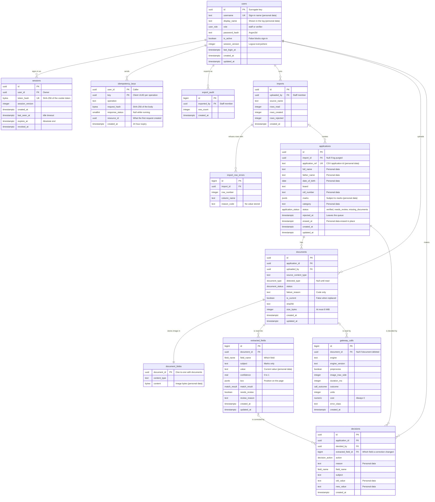

# Entity relationship diagram: Docket

PostgreSQL. 12 tables, 14 relationships.

## Diagram

## Relationships

| From | | To | Meaning |
| --- | --- | --- | --- |
| users | one-to-many | sessions | A user can be signed in on several browsers. Deleting a user deletes the sessions (CASCADE), though users are deactivated, not deleted. |
| users | one-to-many | idempotency_keys | A user's creating requests are remembered for 24 hours so a retry replays the first result. CASCADE because a key means nothing without its user. |
| users | one-to-many | export_audit | Every export of the verified list names who made it. RESTRICT keeps that history. |
| users | one-to-many | imports | Every import names the staff member who ran it. RESTRICT keeps that history. |
| users | one-to-many | documents | Every upload names who made it. RESTRICT keeps that history. |
| users | one-to-many | decisions | Every decision names the verifier who made it. RESTRICT so the log never loses its author. |
| imports | one-to-many | import_row_errors | An import lists its refused rows. CASCADE removes them with the import. |
| imports | zero-or-one to many | applications | An application knows which import created it. SET NULL so purging the import log keeps the applicants. |
| applications | one-to-many | documents | An application has any number of documents, one current per type; replaced ones are kept. CASCADE because documents are the applicant's personal data and go with the record. |
| applications | one-to-many | decisions | An application has a history of decisions. RESTRICT so an application with a log cannot be deleted without first deciding what happens to the log (see the open concern on erasure). |
| documents | one-to-one | document_blobs | The image bytes of a document, kept apart. CASCADE removes the bytes with the document. |
| documents | one-to-many | extracted_fields | A document is read into one row per field and one per subject for marks. CASCADE because they are derived from it. |
| documents | zero-or-one to many | gateway_calls | A document is read by one successful call and any failed ones. SET NULL so the call count survives a deleted document. |
| extracted_fields | zero-or-one to many | decisions | A correction names the exact field of the exact document it changed, since an application can have a name on several documents. SET NULL so erasing a document does not break the log. |

`sessions`, `imports` and `import_row_errors` are not related to the applicant tables except through `applications.import_id`: they exist for sign-in and for reporting what an import refused.
