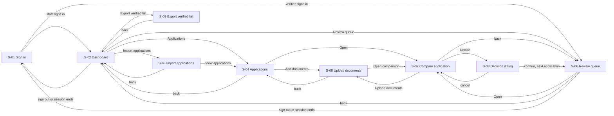
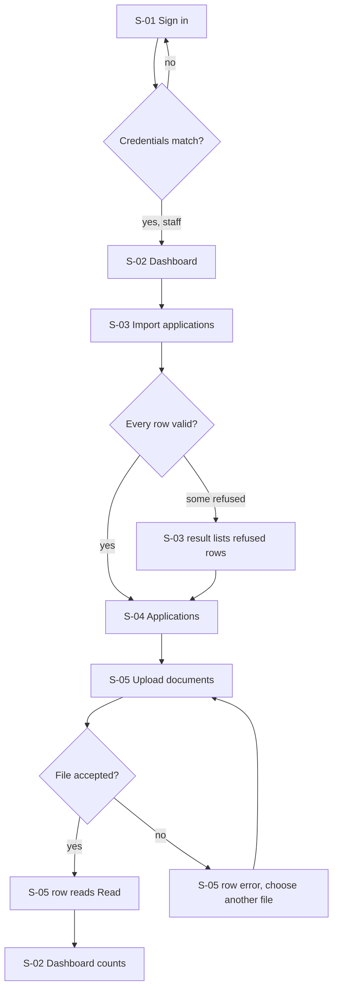
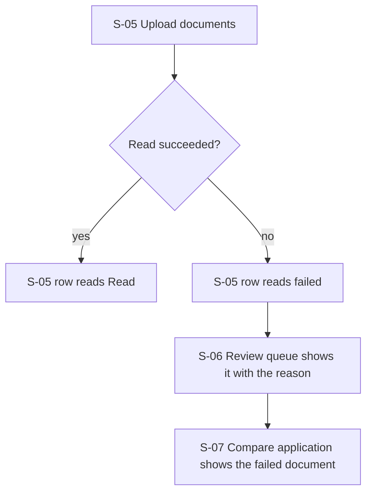
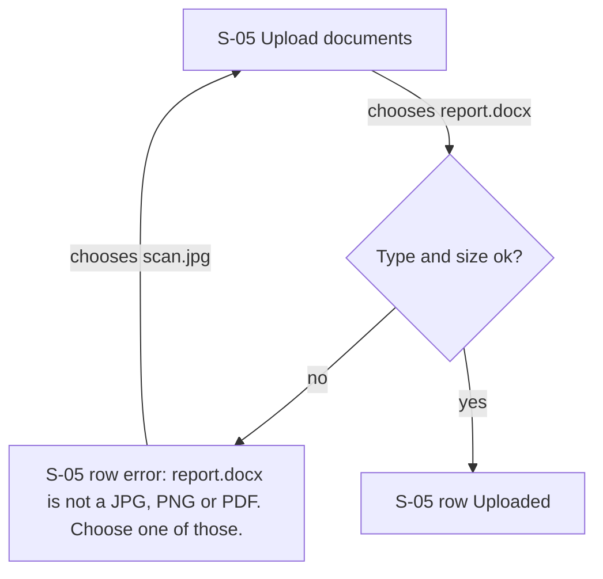
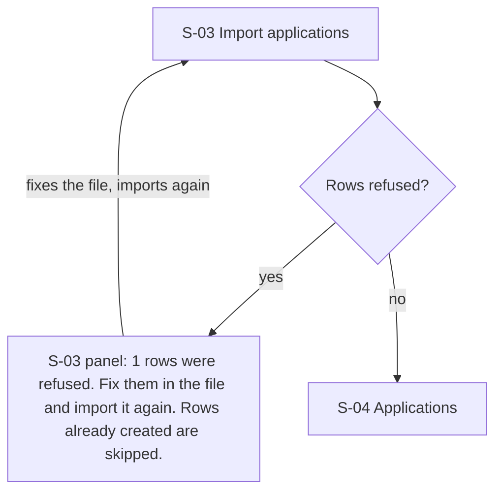
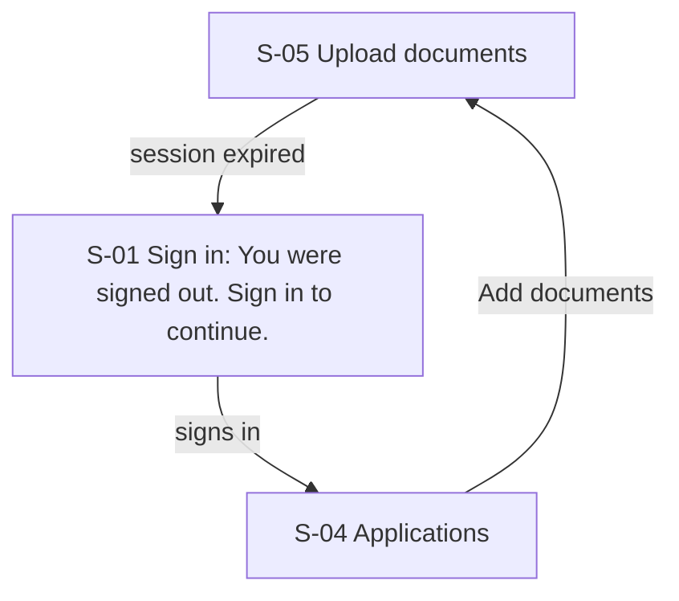
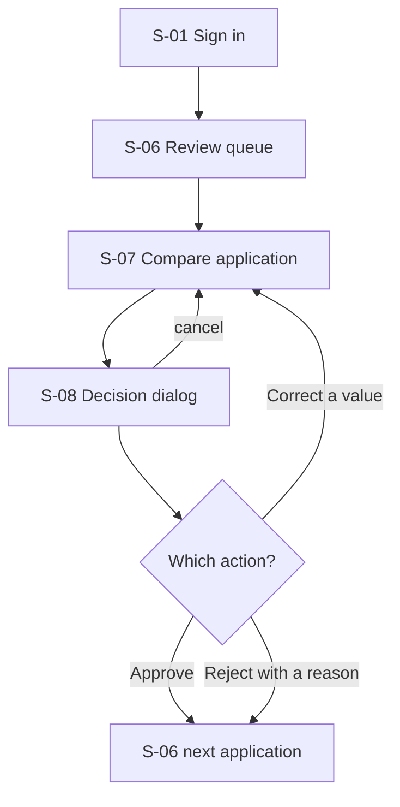
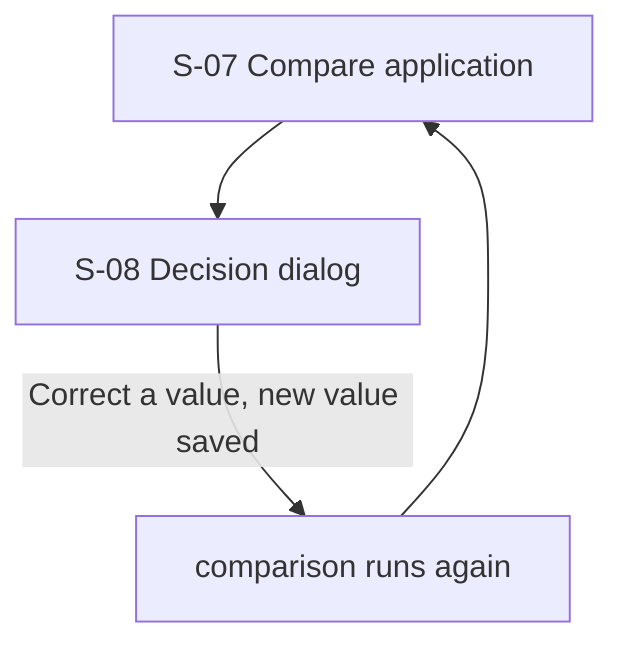
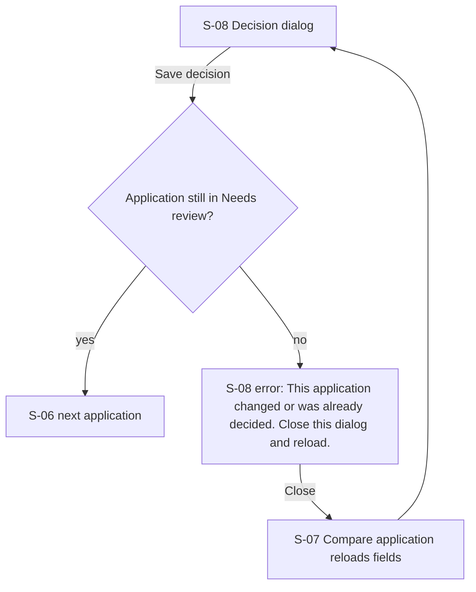
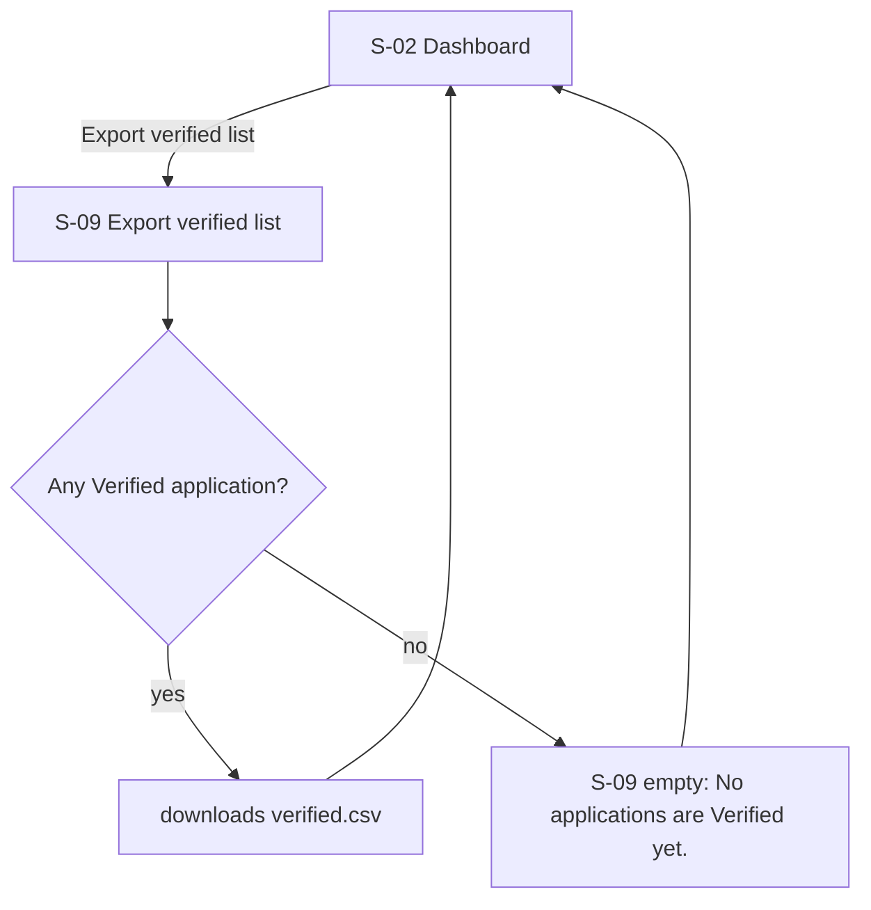

# UX flows: Docket (v1)

Source: docs/product/backlog.md (stories), api/openapi.yaml (the contract, no handlers yet), docs/design/docket-hld.md, docs/design/data-model.md
Stories: US-00-001, US-00-002, US-00-003, US-00-004, US-00-005, US-00-006, US-00-007, US-00-008, US-00-009, US-00-010, US-00-011   Goal: "Get every application verified, and only look at the ones the machine could not settle."
Date: 2026-10-05   Author: draft, unreviewed

Existing screens: none. `frontend/` is a scaffold with no routes or pages, so every screen is `new`. The README-level design system does not exist yet either, so no component name is reused.

## 0. Spec against code

From the contract, no code yet: only `GET /healthz` and `GET /readyz` exist (`app/api/health/router.py:34`, `:40`). Each operation's responses in `api/openapi.yaml` are read as its rejections, and the limits come from the data model and the HLD. A conflict is between the stories and the contract.

| Kind | Item | What the contract or design does (file) | For this request | Spec says / status |
| --- | --- | --- | --- | --- |
| rejection | unauthorized (401) | no session, an expired one, a revoked one or a wrong password (`api/openapi.yaml` Error x-error-codes) | error rows on every screen, and S-01 for a wrong password | new |
| rejection | forbidden (403) | signed in but the role may not do this (`docs/security/permission-matrix.md`) | error: forbidden on S-03, S-05, S-08, S-09 | new |
| rejection | not_found (404) | no such application, document or decision | error: not_found on S-05, S-07 | new |
| rejection | idempotency_conflict (409) | same `Idempotency-Key` with a different body | error row on S-03, S-05, S-08, shown as "Try again" | new |
| rejection | conflict (409) on a decision | the application is no longer in Needs review (`docs/design/data-model.md` processing rule 3) | error: conflict on S-08 | stale_application precondition still open (HLD section 16) |
| rejection | payload_too_large (413) | file over 8 MiB, or a CSV over the size cap (PS-06) | error: too large on S-03, S-05 | new |
| rejection | unsupported_media_type (415) | type or first bytes not JPEG, PNG, PDF (or CSV) | error: wrong type on S-03, S-05 | new |
| rejection | validation_error (422) | a rule is broken, `details.errors` names the field, never the value | error on S-03, S-08 | new |
| rejection | rate_limited (429) | too many sign-in attempts, `Retry-After` seconds | error: rate_limited on S-01 | new, PS-01 |
| rejection | service_unavailable (503) | database not reachable | error: unavailable on every screen | exists as an envelope (`app/core/errors.py`) |
| rejection | internal (500) | unexpected failure, `request_id` in the body | error: internal on every screen | exists as an envelope |
| number | file size cap | 8 MiB per upload, checked while streaming (`docs/design/uploads-pattern.md`) | "8 MB" is never shown, the copy says "8 MiB" | assumption, product owner unconfirmed |
| number | accepted types | JPEG, PNG, PDF (first page only) | copy lists the three | AC-US-00-002-2 |
| number | session idle and absolute | 30 minutes idle, 8 hours absolute (`docs/security/AUTH.md`) | S-01 reads "You were signed out" without a duration | assumption, unconfirmed |
| number | sign-in limit | five failed attempts in a minute per source, then refused (PS-01) | copy reads the wait from `Retry-After`, never a fixed number | proposed story |
| number | page size | default 20, at most 100 (`api/openapi.yaml` Limit) | 600 flagged applications (12% of 5,000) is 30 pages of 20 | contract |
| number | idempotency window | 24 hours, per user and key (`idempotency_keys`) | a double click on "Import applications" makes one import | new table |
| number | read speed | 1.42 s per page on the benchmark machine, so a 30 document batch is about 43 s (HLD section 8) | S-05 shows per-document status, no overall time promised | measured on Python 3.12 only |
| number | review rate | about 12% of applications reach Needs review (ADR-0005) | S-06 reads its count from the server | provisional cutoff |
| route | `/api/auth/login`, `/logout`, `/me` | new (contract) | S-01 | dependency, US-00-011 |
| route | `/api/imports`, `/api/applications`, `/api/applications/{id}`, `/documents`, `/decisions`, `/api/documents/{id}/image`, `/api/dashboard`, `/api/exports/verified.csv` | new (contract) | S-02 to S-09 | dependencies |
| route | frontend `/api` proxy | commented out in `frontend/nginx.conf` | the browser cannot reach the API through nginx today | dependency, PS-11 |
| field | OCR box position | `ExtractedField.box` is x, y, width and height in pixels of the stored image (`api/openapi.yaml`) | S-07 draws boxes on the image | exists in the contract, engine must return it (US-00-010 flag) |
| guard missing | the application changed while the verifier had it open | a decision on stale data is not stopped by the row lock alone | state on S-08: "This application changed" | backend note, HLD section 16 |
| guard missing | a document finished reading while the page was open | the list does not update by itself | S-05 polls, S-07 shows "New result available. Reload fields." | contract has no push |
| guard missing | the session ended mid upload | the upload returns 401 and the file is not stored | error row on S-05, the file name stays selected | new |

Conflicts between the stories and the contract (each in open questions):

- US-00-008 gives the dashboard to staff only, and `docs/security/AUTH.md` lets both roles read it (open question 1).
- AC-US-00-002-1 says "the file is stored", and ADR-0007 and ADR-0010 store the re-encoded first page, not the original (open question 2).
- AC-US-00-005-3 lists Missing documents, but a failed read makes Needs review, so S-04 must show a failed document under Needs review (open question 3).
- A rejected application stays Needs review but leaves the queue (Q-006), so the dashboard "Needs review" count includes it (`api/openapi.yaml` Dashboard). S-02 shows the rejected count separately (open question 4).

## 1. Screen inventory

| Id | Screen | Purpose (one sentence) | Serves | Entry from | Exits to | Status |
| --- | --- | --- | --- | --- | --- | --- |
| S-01 | Sign in | Gets a staff member or verifier into the product with their own account. | US-00-011 | any route when signed out, session end | S-02 (staff), S-06 (verifier) | new |
| S-02 | Dashboard | Shows how many applications are Verified, Needs review and Missing documents, and leads to the next job. | US-00-008, US-00-005 | S-01, S-03, S-09, top bar | S-03, S-04, S-06, S-09, sign out to S-01 | new |
| S-03 | Import applications | Loads applications from a CSV and says which rows were refused and why. | US-00-001 | S-02, S-04 | S-04, S-02, back to S-02 | new |
| S-04 | Applications | Lists every application with its status so staff can find one and add its documents. | US-00-005, US-00-002 | S-02, S-03, S-05, top bar | S-05, S-07, S-02, back to S-02 | new |
| S-05 | Upload documents | Adds scans to one application and shows what the machine read from each. | US-00-002, US-00-003 | S-04, S-07 | S-04, S-07, back to S-04 | new |
| S-06 | Review queue | Lists the flagged applications a verifier still has to decide. | US-00-006, US-00-005 | S-01 (verifier), S-02, S-08 | S-07, S-02, sign out to S-01 | new |
| S-07 | Compare application | Shows each document beside the application value, field by field, with the OCR box and a confidence badge. | US-00-004, US-00-006, US-00-010 | S-04, S-06, S-08 | S-08, S-06, S-05, back to S-06 | new |
| S-08 (modal) | Decision dialog | Records an approve, a corrected value or a rejection with its reason. | US-00-007 | S-07 | cancel to S-07, confirm to S-06 | new |
| S-09 | Export verified list | Downloads the Verified applications as a CSV. | US-00-009 | S-02 | S-02, back to S-02 | new |

Stories with no screen: none of US-00-001 to US-00-011. US-02-001, US-02-002, US-02-003 and US-02-004 have no user-facing screen (gateway, engine choice, seed and eval report); they are in open question 5.

Site-wide, no screen of its own: REQ-044 (nothing leaves the machine) is carried by the copy on S-05 ("Read on this machine") and by the absence of any third-party control; accessibility and the design system are carried by section 7 (targets, keyboard) and the `design-system` step.

## 2. Interaction states

### S-01 Sign in

| State | The user sees | Copy |
| --- | --- | --- |
| loading | the form is shown, "Sign in" disabled with its label kept while the request runs | "Signing in" on the button |
| empty | an empty username and password, focus on username | "Sign in to Docket" / "Sign in" |
| error: unauthorized | inline above the button, both fields keep their values except the password, focus moves to the message | "That username and password do not match. Check them and try again." |
| error: rate_limited | inline above the button, "Sign in" disabled until the wait ends, the wait read from the server | "Too many attempts. Try again in {Retry-After} seconds." |
| error: unavailable | inline above the button, the form stays usable | "Docket cannot reach its database. Try again in a minute." |
| success | the app opens on S-02 (staff) or S-06 (verifier), focus on the page heading | "Signed in as {display_name}" |
| partial | n/a: the form is one source and one request | |
| offline | the form stays, "Sign in" disabled | "You are offline. Connect and try again." |
| session ended | after an idle or absolute expiry, this screen with a notice, the address of the page they were on is kept | "You were signed out. Sign in to continue." |

### S-02 Dashboard

| State | The user sees | Copy |
| --- | --- | --- |
| loading | three count tiles as skeletons, the page heading and the actions stay visible | "Dashboard" |
| empty | zero in every tile and one invitation | "No applications yet." / "Import applications" |
| error: internal | message in place of the tiles, the actions stay usable | "The counts did not load. Reload the page, or quote request {request_id} to the engineering team." |
| error: unauthorized | goes to S-01 with the session-ended notice | "You were signed out. Sign in to continue." |
| error: unavailable | message in place of the tiles | "Docket cannot reach its database. Try again in a minute." |
| success | tiles for Verified, Needs review (with "of which rejected" beneath it) and Missing documents, each a link to S-04 filtered by that status, and the verifier's "Review queue" count links to S-06 | "{n} Verified" / "{n} Needs review, {r} rejected" / "{n} Missing documents" |
| partial | n/a: one request returns all counts | |
| offline | the last counts stay with the time they were read | "Offline. Counts as of {time}." |

### S-03 Import applications

| State | The user sees | Copy |
| --- | --- | --- |
| loading | file chosen, "Import applications" disabled with its label kept, a progress line | "Importing {file_name}" |
| empty | a file drop area, the eight required columns listed, a link to a sample header | "Choose a CSV file" / "Choose file" |
| error: payload_too_large | under the drop area, the chosen file is shown and can be replaced | "That file is too large. Split it into smaller files and import each." |
| error: unsupported_media_type | under the drop area | "That is not a CSV file. Choose a .csv file." |
| error: validation_error | under the drop area, names the missing column, never a value | "The file is missing the column {column_name}. Add it and import again." |
| error: forbidden | replaces the form, a link back | "Only staff can import applications. Go to the dashboard." |
| error: idempotency_conflict | inline, the file stays chosen | "This import was already sent with a different file. Choose the file again and import." |
| error: unavailable | inline, the file stays chosen | "Docket cannot reach its database. Nothing was imported. Try again in a minute." |
| success | a result panel, focus on its heading, "View applications" | "Imported {rows_created} of {rows_read} rows." |
| partial | the same panel with a table of refused rows (row number, column, reason), a "Download refused rows" is not offered because values are never kept | "{rows_rejected} rows were refused. Fix them in the file and import it again. Rows already created are skipped." |
| offline | "Import applications" disabled, the file stays chosen | "You are offline. Connect to import." |

### S-04 Applications

| State | The user sees | Copy |
| --- | --- | --- |
| loading | six skeleton rows, the status filter stays usable | "Applications" |
| empty | no rows, one action | "No applications yet." / "Import applications" |
| error: internal | message above an empty table, "Reload" | "The list did not load. Reload, or quote request {request_id}." |
| error: unavailable | message above an empty table | "Docket cannot reach its database. Try again in a minute." |
| success | a table of reference, name, status and documents read, 20 rows, a status filter, newest change first | "{n} applications" |
| partial | the first page is shown and "Load more" keeps the rows already loaded | "20 of {n} shown. Load more." |
| filtered empty | the filter returns nothing | "No applications are {status}." / "Clear filter" |
| offline | the rows loaded stay, Load more disabled | "Offline. Showing what was loaded." |

### S-05 Upload documents

| State | The user sees | Copy |
| --- | --- | --- |
| loading | the document list as skeleton rows, the drop area usable | "Documents for {application_ref}" |
| empty | no document yet, the three required types listed | "No documents yet. Upload a 10th marksheet, a 12th marksheet and an ID proof." / "Choose files" |
| error: payload_too_large | on the file's own row, other files in the batch continue | "{file_name} is over 8 MiB. Choose a smaller scan or photo." |
| error: unsupported_media_type | on the file's own row | "{file_name} is not a JPG, PNG or PDF. Choose one of those." |
| error: validation_error | on the file's own row, for an image over the pixel cap | "{file_name} is too large in pixels. Reduce its size and upload it again." |
| error: not_found | replaces the page | "That application does not exist. Go to Applications." |
| error: forbidden | the drop area is replaced by the list, read only | "Only staff can upload documents." |
| error: unauthorized | goes to S-01, chosen files are listed again after sign in is not possible, so the page says so | "You were signed out. Sign in, then choose the files again." |
| error: failed read | on the document row, with a "Reprocess" control (`reprocessDocument`, staff only) beside "Upload a clearer photo" | "Docket could not read {file_name}. Reprocess it, or upload a clearer photo." |
| success | each document row moves from "Uploaded" to "Reading" to "Read", with the detected type, focus stays on the drop area | "Read: 10th marksheet" |
| partial | some files read, some reading, some failed, each on its own row, a summary line above | "{r} read, {p} reading, {f} failed." |
| offline | upload disabled, chosen files stay | "You are offline. Connect to upload." |
| duplicate | identical bytes already stored for this application | "{file_name} is already uploaded. Nothing changed." |

### S-06 Review queue

| State | The user sees | Copy |
| --- | --- | --- |
| loading | six skeleton rows | "Review queue" |
| empty | nothing flagged, one pointer | "Nothing needs review." / "Go to the dashboard" |
| error: internal | message above an empty list, "Reload" | "The queue did not load. Reload, or quote request {request_id}." |
| error: forbidden | replaces the list | "Only verifiers work the review queue. Go to the dashboard." |
| error: unavailable | message above the list | "Docket cannot reach its database. Try again in a minute." |
| success | rows of reference, name and the reason it was flagged (a mismatch, a low confidence, a failed read), oldest first, "Review next" at the top | "{n} to review" |
| partial | the first 20 rows are shown, the rest load on request | "20 of {n} shown. Load more." |
| offline | the loaded rows stay, opening a row is disabled | "Offline. Showing what was loaded." |

### S-07 Compare application

| State | The user sees | Copy |
| --- | --- | --- |
| loading | the header (reference and name) and two skeleton columns, the image area empty | "Loading {application_ref}" |
| empty | an application with no document read yet, no fields to compare | "No documents have been read yet." / "Upload documents" |
| error: not_found | replaces the page, a link to the queue | "That application does not exist. Go to the review queue." |
| error: internal | message in place of the fields, the header stays | "The application did not load. Reload, or quote request {request_id}." |
| error: image failed | the field list stays, the image area shows a message | "The document image did not load. Reload the image." |
| success | per document a list of fields; each row shows the application value, the document value, a match mark, a confidence badge and, when the row is selected, the OCR box on the image; failed fields are marked and listed first; the decision buttons are enabled | "Name: application Latha Sharma, document Latha Sharma, Match, 99%" |
| partial | some documents read, one reading or failed; the compare view shows what is read | "2 of 3 documents read. The 12th marksheet failed: upload a clearer photo." |
| low confidence | a field whose confidence is under the configured cutoff carries an amber badge and the reason | "Low confidence: check this value against the image." |
| no box | a field with no position on the image | "No position for this field. The full document is shown." |
| stale | the application changed while open | "This application changed. Reload fields." / "Reload" |
| offline | the view stays as loaded, decision buttons disabled | "You are offline. Connect to decide." |

### S-08 Decision dialog

| State | The user sees | Copy |
| --- | --- | --- |
| loading | the chosen action is shown, the confirm button disabled with its label kept | "Saving decision" |
| empty | three choices (Approve, Correct a value, Reject), none chosen, focus on the first | "Decide {application_ref}" |
| error: validation_error | a rejection without a reason, inline under the reason field, the typed text stays | "Add a reason to reject this application." |
| error: conflict | inline at the top of the dialog, the dialog stays open | "This application changed or was already decided. Close this dialog and reload." |
| error: forbidden | inline, the confirm button hidden | "Only verifiers can decide applications." |
| error: idempotency_conflict | inline, the text stays | "This decision was already sent with different text. Review it and confirm again." |
| error: unavailable | inline, the text stays | "Docket cannot reach its database. Nothing was saved. Try again in a minute." |
| success | the dialog closes, the queue moves to the next application, focus on its heading, a toast with Undo is not offered because the log is append-only | "Decision saved: Approved" |
| partial | n/a: one decision is one request | |
| offline | the confirm button disabled, the text stays | "You are offline. Connect to save the decision." |

### S-09 Export verified list

| State | The user sees | Copy |
| --- | --- | --- |
| loading | "Download CSV" disabled with its label kept | "Preparing the file" |
| empty | no Verified application | "No applications are Verified yet." / "Go to the dashboard" |
| error: forbidden | replaces the button | "Only staff can export the verified list." |
| error: internal | inline above the button | "The export did not finish. Try again, or quote request {request_id}." |
| error: unavailable | inline above the button | "Docket cannot reach its database. Try again in a minute." |
| success | the file downloads, a line records the row count and focus returns to the button | "Downloaded verified.csv with {n} rows." |
| partial | n/a: the file is one response | |
| offline | the button disabled | "You are offline. Connect to download." |

## 3. Journey storyboard

Goal: "Load the intake, let the machine read it, and decide only the applications it flagged."

| Step | User does | User sees | User feels | Design answers with |
| --- | --- | --- | --- | --- |
| 1 | Signs in as staff | S-01 form, then S-02 with counts | unsure the system knows their role | the page greets by name and shows only staff actions |
| 2 | Imports the CSV | S-03 result panel | afraid some rows were silently dropped | "Imported 19 of 20 rows." and a table of the refused row with its reason |
| 3 | Opens an application and uploads three scans | S-05 rows moving from Uploaded to Read | worried the file did not arrive or is being sent somewhere | each row keeps its file name and "Read on this machine" |
| 4 | Returns to the dashboard | S-02 counts, Needs review rising | anxious about how much is left for people | the count and "of which rejected" read from the server |
| 5 | A verifier opens the queue | S-06 oldest first, with the reason per row | overwhelmed by volume | "Review next" and the count at the top |
| 6 | Opens an application | S-07 failed fields first, the image beside them | wants to see why it was flagged | the box on the image and the confidence badge per field |
| 7 | Approves, corrects or rejects | S-08, then the next application | afraid of a wrong click that cannot be undone | the dialog names the action, rejects need a reason, the log is shown as permanent in the dialog text |
| 8 | Exports the verified list | S-09 download | unsure which applications are in it | "Downloaded verified.csv with {n} rows." |

Five-second read: a stranger sees that Docket checks documents against applications and that the big numbers are applications Verified, Needs review and Missing documents.
Five-minute read: staff can import a file, add documents to an application and watch them read; a verifier can open the queue, compare each field with its image, decide, and see the dashboard move.

## 4. Navigation map

## 5. Flows

### Journey: staff load and read a batch

Persona: Admissions staff, group 00   Platforms: desktop web, phone web
Trigger: the admissions office receives the intake CSV and the scanned documents   Exercises: US-00-011, US-00-001, US-00-002, US-00-003, US-00-005, US-00-008

Before it starts:
- a seeded staff account exists, and the API and database are running
- a CSV with the eight required columns, one malformed row, and three scans for one application

| Step | Screen | The user | The system |
| --- | --- | --- | --- |
| 1 | S-01 Sign in | enters username and password, presses "Sign in" | sets the session cookie and shows S-02 with focus on the heading |
| 2 | S-02 Dashboard | presses "Import applications" | shows S-03 |
| 3 | S-03 Import applications | chooses the CSV, presses "Import applications" | creates the valid rows in one transaction and shows "Imported 19 of 20 rows." with the refused row listed |
| 4 | S-04 Applications | presses "Add documents" on one application | shows S-05 for that application |
| 5 | S-05 Upload documents | chooses three files | each file becomes a row, is stored, then read in the background, and the row reads "Read: {type}" |
| 6 | S-02 Dashboard | opens the dashboard | shows the counts, now with the application Verified or Needs review |

| At step | Alternate path (condition) | What happens |
| --- | --- | --- |
| 3 | the CSV has no refused rows | the panel reads "Imported 20 of 20 rows." with no table, and "View applications" is the main action |
| 5 | a PDF of several pages is chosen | only its first page is read, the row says so, and the flow continues |
| 5 | a document of the same type is already uploaded | the newer one is used and the older is kept, the row says "Replaces the earlier 10th marksheet" |

| At step | When it fails (condition) | What the user sees | Recovery |
| --- | --- | --- | --- |
| 1 | wrong password | "That username and password do not match. Check them and try again." | edit the password and retry |
| 3 | file over the size cap | "That file is too large. Split it into smaller files and import each." | choose another file |
| 3 | one row refused | "1 rows were refused. Fix them in the file and import it again. Rows already created are skipped." | fix the file, import again |
| 5 | file over 8 MiB or wrong type | the row-level copy in S-05 | choose a different file, the rest of the batch continues |
| 5 | the read fails | "Docket could not read {file_name}. Upload a clearer photo of it." | upload a different photo |

Afterwards: 19 applications exist, the three scans are stored and read, and the dashboard counts are updated.

### Alternate: a document fails to read

A failed read marks the application Needs review, so the verifier sees it.

### Error recovery: S-05 file over 8 MiB or wrong type

### Error recovery: S-03 refused rows

### Error recovery: session ends during an upload

### Journey: a verifier works the queue

Persona: Verifier, group 00   Platforms: desktop web, phone web
Trigger: applications are flagged Needs review   Exercises: US-00-011, US-00-006, US-00-004, US-00-007, US-00-010, US-00-008

Before it starts:
- a seeded verifier account, and at least one application in Needs review with one mismatching field and one low-confidence field

| Step | Screen | The user | The system |
| --- | --- | --- | --- |
| 1 | S-01 Sign in | signs in | shows S-06 with focus on the heading |
| 2 | S-06 Review queue | presses "Review next" | opens the oldest flagged application on S-07 |
| 3 | S-07 Compare application | selects a failed field | draws its OCR box on the image and shows the confidence badge |
| 4 | S-07 Compare application | presses "Decide" | opens S-08 with the three choices |
| 5 | S-08 Decision dialog | chooses "Reject", types a reason, presses "Save decision" | logs who, when, what and why, removes the application from the queue and shows the next on S-06 |

| At step | Alternate path (condition) | What happens |
| --- | --- | --- |
| 4 | the value read is wrong and the application is right | the verifier chooses "Correct a value", picks the field, types the value, and the comparison runs again, rejoining at S-07 |
| 4 | everything matches after review | the verifier chooses "Approve", the status becomes Verified, and the flow rejoins at S-06 |

| At step | When it fails (condition) | What the user sees | Recovery |
| --- | --- | --- | --- |
| 5 | reject without a reason | "Add a reason to reject this application." | type a reason, the dialog stays open |
| 5 | another verifier decided first, or the application changed | "This application changed or was already decided. Close this dialog and reload." | close the dialog, reload fields, decide again |
| 3 | the image does not load | "The document image did not load. Reload the image." | reload the image, the field list stays |

Afterwards: a decision row exists with who, when, what and why, and the application is Verified or out of the queue.

### Alternate: correct a value

### Error recovery: S-08 decision on a stale application

### Alternate: export the verified list

## 6. Decision points and dead-end check

| Branch | Condition | If yes | If no |
| --- | --- | --- | --- |
| Credentials | the username and password match an active user | S-02 (staff) or S-06 (verifier) | S-01 with the error |
| Import rows | every row valid | S-04 | S-03 result lists refused rows, then S-04 |
| Upload file | type and size accepted | S-05 row Uploaded | S-05 row error, choose another file |
| Read | the engine returned fields | S-05 row Read | S-05 row failed, application Needs review |
| Decision | the application is still in Needs review | S-06 next application | S-08 error, reload on S-07 |
| Export | at least one application is Verified | download | S-09 empty |

| Screen | Way forward | Way back | Dead end |
| --- | --- | --- | --- |
| S-01 | "Sign in" to S-02 or S-06 | n/a: entry point, the browser back leaves the app | no |
| S-02 | "Import applications" to S-03 | "Sign out" to S-01 | no |
| S-03 | "View applications" to S-04 | "Back to dashboard" to S-02 | no |
| S-04 | "Add documents" to S-05, "Open" to S-07 | "Back to dashboard" to S-02 | no |
| S-05 | "Open comparison" to S-07 | "Back to applications" to S-04 | no |
| S-06 | "Open" to S-07 | "Back to dashboard" to S-02 | no |
| S-07 | "Decide" to S-08 | "Back to review queue" to S-06 | no |
| S-08 | "Save decision" to S-06 | "Cancel" to S-07 | no |
| S-09 | "Download CSV" stays and records the download | "Back to dashboard" to S-02 | no |

Dead ends: 0

## 7. Interaction inventory

Page chrome, every page: a top bar with the product name "Docket" (link to the dashboard or the queue), the signed-in name and role, "Sign out" (button, 44 px, Tab, Enter), and a "Keyboard shortcuts" button (button, "?" opens the list). No sheet exists, so events read `no sheet`.

| Screen | Control | Type | Label | Target | Keyboard | Event |
| --- | --- | --- | --- | --- | --- | --- |
| S-01 | Username | input | "Username" | 44 px | Tab 1 | no sheet |
| S-01 | Password | input | "Password" | 44 px | Tab 2 | no sheet |
| S-01 | Sign in | button | "Sign in" | 48 px | Tab 3, Enter | no sheet |
| S-02 | Verified tile | link | "{n} Verified" | 44 px | Tab, Enter | no sheet |
| S-02 | Needs review tile | link | "{n} Needs review" | 44 px | Tab, Enter | no sheet |
| S-02 | Missing documents tile | link | "{n} Missing documents" | 44 px | Tab, Enter | no sheet |
| S-02 | Import applications | button | "Import applications" | 48 px | Tab, Enter, g then i | no sheet |
| S-02 | Review queue | link | "Review queue" | 44 px | Tab, Enter, g then q | no sheet |
| S-02 | Export verified list | link | "Export verified list" | 44 px | Tab, Enter, g then e | no sheet |
| S-03 | Choose file | button | "Choose file" | 44 px | Tab 1, Enter | no sheet |
| S-03 | Import | button | "Import applications" | 48 px | Tab 2, Enter | no sheet |
| S-03 | View applications | link | "View applications" | 44 px | Tab, Enter | no sheet |
| S-04 | Status filter | select | "Status" | 44 px | Tab 1, arrows | no sheet |
| S-04 | Add documents | button | "Add documents" | 44 px | Tab, Enter | no sheet |
| S-04 | Open | link | "Open" | 44 px | Tab, Enter | no sheet |
| S-04 | Load more | button | "Load more" | 44 px | Tab, Enter | no sheet |
| S-05 | Choose files | button | "Choose files" | 48 px | Tab 1, Enter | no sheet |
| S-05 | Drop area | region | "Drop files here" | 96 px | Tab 1, Enter opens the picker | no sheet |
| S-05 | Open comparison | link | "Open comparison" | 44 px | Tab, Enter | no sheet |
| S-05 | Back to applications | link | "Back to applications" | 44 px | Tab, Alt+Left | no sheet |
| S-06 | Review next | button | "Review next" | 48 px | Tab 1, Enter, n | no sheet |
| S-06 | Row | link | "Open {application_ref}" | 44 px | j and k move, Enter opens | no sheet |
| S-06 | Load more | button | "Load more" | 44 px | Tab, Enter | no sheet |
| S-07 | Field row | listbox option | "{field}: application {application value}, document {document value}" | 44 px | j and k move, Enter selects | no sheet |
| S-07 | Next and previous document | button | "Next document", "Previous document" | 44 px | ] and [ | no sheet |
| S-07 | Zoom image | button | "Zoom in", "Zoom out" | 44 px | + and - | no sheet |
| S-07 | Decide | button | "Decide" | 48 px | Tab, Enter, d | no sheet |
| S-07 | Back to review queue | link | "Back to review queue" | 44 px | Tab, Alt+Left | no sheet |
| S-08 | Action | radio group | "Approve", "Correct a value", "Reject" | 44 px | a, c, r select, arrows move | no sheet |
| S-08 | Field and new value | select and input | "Field", "New value" | 44 px | Tab | no sheet |
| S-08 | Reason | textarea | "Reason" | 96 px | Tab | no sheet |
| S-08 | Save decision | button | "Save decision" | 48 px | Tab, Enter, Ctrl+Enter | no sheet |
| S-08 | Cancel | button | "Cancel" | 44 px | Tab, Esc | no sheet |
| S-09 | Download CSV | button | "Download CSV" | 48 px | Tab, Enter | no sheet |
| S-09 | Back to dashboard | link | "Back to dashboard" | 44 px | Tab, Alt+Left | no sheet |

Shortcuts are listed in the "Keyboard shortcuts" dialog (opened with "?") and never fire while a text field has focus.

## 8. Open questions

| # | Question | Owner | By | If deferred, what ships |
| --- | --- | --- | --- | --- |
| 1 | May verifiers read the dashboard counts (US-00-008 names staff only)? | product owner | 2026-10-31 | both roles see S-02, counts only |
| 2 | May the original upload be discarded and only its first-page image kept (AC-US-00-002-1)? | product owner | 2026-10-31 | S-05 says "Stored as a page image" |
| 3 | Where does a failed document show: Needs review, or Missing documents? | product owner | 2026-10-31 | Needs review, with the failed document named on S-07 |
| 4 | Should the dashboard show rejected separately from Needs review? | product owner | 2026-10-31 | "Needs review, of which rejected" as drawn |
| 5 | US-02-001 to US-02-004 have no screen. Is an engine status or eval screen wanted? | product owner | 2026-10-31 | none, the eval report stays a file |
| 6 | The contract now has `reprocessDocument` (PS-12): is the "Reprocess" control on S-05 wanted, and is it a story? | product owner | 2026-10-31 | the control ships on S-05 as drawn |
| 7 | The contract now sends an ETag and requires `If-Match` on a decision: does S-07 keep the ETag it loaded? | backend lead rotation | 2026-10-31 | S-07 keeps the ETag and the dialog shows the conflict copy after a 409 |
| 8 | `listDecisions` now exists. Where do staff and verifiers see the decision log (AC-US-00-007-5)? | product owner | 2026-10-31 | no screen, the log is read only through the API until a screen is designed |
| 9 | Is the session idle and absolute lifetime 30 minutes and 8 hours? | product owner | 2026-10-31 | S-01 reads "You were signed out" with no duration |
| 10 | Are keyboard shortcuts wanted on a phone, where there is no keyboard? | design lead | 2026-10-31 | shortcuts on desktop only, all controls reachable by touch |
| 11 | There is no destructive action with an undo window: the decision log is append-only. Is an "undo last decision" wanted? | product owner | 2026-10-31 | no undo, the dialog states that a decision is logged |
| 12 | Which events does the analytics sheet name for the controls above (analytics is out of scope today)? | analytics owner | 2026-11-15 | every control reads `no sheet` |

## 9. Self-review

| Check | Result | Note |
| --- | --- | --- |
| F1 fewest thoughts | pass | the staff path has no decisions that need reading, the verifier path has one (which action), and "Review next" is the visible default |
| F2 dead ends | pass | the table in section 6 reads 0 by my reading, `flows_check.py` not run |
| F3 error recovery on every path | pass | every error row names a control or pointer, three recovery flows are drawn and the rest are one-step retries |
| F4 state coverage per screen | pass | every screen has loading, empty, error and success rows, `n/a` rows carry a reason, gate not run |
| F5 copy is written | pass | every cell has literal copy |
| F6 pattern consistency across screens | pass | "Back to {screen}" is the back control on every non-modal screen, Cancel and Esc close the modal |
| F7 trunk test per screen | pass | every screen carries the "Docket" top bar and its own heading |
| F8 story coverage | fixed | US-00-010 got the "no box" state on S-07, and US-02-001 to US-02-004 moved to open question 5 |
| F9 goodwill drains | pass | nothing is hidden until late, no tour, the refused rows are shown without a retype |
| F10 controls are reachable | pass | every control has a target and a keyboard path, nothing depends on hover |
| F11 analytics honesty | open | no sheet exists, every event reads `no sheet` (question 12) |
| F12 open questions carry cost | pass | every question has an owner, a date and a fallback |
| F13 spec matches code | open | there is no handler code, the ledger reads the contract; the stale-decision guard and the reprocess operation are open (questions 6 and 7) |
