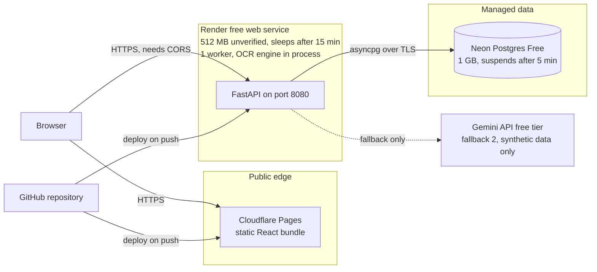

# Free hosting for Docket: static frontend, Python OCR API, Postgres

Date: 2026-10-05   Timebox: 1 h (start time not recorded, see "Not run")   Stopped because: answered, with gaps listed below
Location: no throwaway code was written
Prior work: `docs/research/ocr-landscape.md` (engine shortlist and the 512 MB budget). Held: it is two days old and nothing in the code changed it.
Status of every recommendation here: Proposed. No decider is recorded. It fits `CONSTRAINTS.md:L7-L15` (zero cost, no card, free hosting).

## Question

Can Docket's demo run at zero cost with no credit card on any account: a static React frontend, a Python FastAPI service that runs an OCR engine in at most 512 MB, and Postgres?

## Answered looks like

A named stack in which every component has an official page (fetched 2026-10-05) stating a free plan, with no card needed, and a limit that fits Docket's size. Not required: a running deployment.

## Answer

**Yes, conditionally.** The cheapest stack that passes on the evidence is Cloudflare Pages (frontend), a Render free web service (API) and Neon Free (Postgres). Three conditions:

1. The OCR engine has to fit in about 512 MB. Render's free instance RAM could not be confirmed from an official page, so this is unverified, and no engine has a measured RAM figure yet.
2. The demo has to tolerate cold starts: about 1 minute for Render after 15 minutes idle (stated on [Render free docs](https://render.com/docs/free)), plus a wake delay for Neon after 5 minutes idle ([Neon pricing](https://neon.com/pricing)).
3. Card-free holds for Neon (stated) and Render until limits are hit (see below). For Cloudflare it was not stated on any page fetched.

**No host gives a card-free, free-forever API with 1 GB of RAM.** If the engine needs more than 512 MB, the fallbacks below remove the engine from the API host instead.

## Operative inputs

Read from the code, not from docs.

| Input | Value | Source |
| --- | --- | --- |
| API image | Python 3.14 slim-bookworm, gunicorn with uvicorn workers, port 8080 | `Dockerfile:14`, `Dockerfile:18`, `Dockerfile:25` |
| Workers | `WEB_CONCURRENCY=2` | `Dockerfile:18` |
| Request timeout | 60 s, graceful 30 s | `Dockerfile:25` |
| OCR packages in the image | none: no Tesseract binary, no onnxruntime | `Dockerfile:1-25` |
| Database driver and URL rule | asyncpg; the URL must start `postgresql+asyncpg://` | `app/core/config.py:37`, `app/db/session.py:19-25` |
| Connection pool | pool size 5 plus overflow 10 per process | `app/core/config.py:29-30` |
| Readiness | `/readyz` fails with 503 when the database does not answer | `app/api/health/router.py:40-50` |
| CORS | none configured | `app/main.py:55-59` |
| Frontend build | nginx serving a static bundle; `VITE_API_URL` is fixed at build time, default `/api` | `frontend/Dockerfile:12-14` |
| Uploads | no storage code exists yet | `app/domain/` is empty |

Findings from these, all affecting hosting:

- **Two workers double OCR memory.** Each gunicorn worker loads its own engine, so `WEB_CONCURRENCY=2` roughly doubles the model's RAM. For a 512 MB host it has to be 1 (`Dockerfile:18`).
- **The database URL needs rewriting.** Neon's connection strings begin `postgresql://` and carry `sslmode=require` (the format is Neon's standard, not checked on a fetched page). `config.py:37` rejects that scheme, and asyncpg takes `ssl=` not `sslmode=`. Add a small conversion in settings, not in the host's environment variable.
- **A static frontend on another host needs CORS.** `VITE_API_URL=/api` only works when one origin serves both. With Cloudflare Pages and Render as separate origins, the API needs CORS for the Pages origin and the frontend needs the API's absolute URL at build time.
- **Free-tier disks are ephemeral.** Render's free filesystem is ephemeral ([Render free docs](https://render.com/docs/free)). Uploaded documents would vanish on every restart or redeploy. Store image bytes in Postgres (about 30 small PNGs fit easily in Neon's 1 GB) or regenerate them from the seed.

## Recommended stack (Proposed)

| Part | Choice | Why | Official source |
| --- | --- | --- | --- |
| Frontend | Cloudflare Pages Free | Static asset requests are "free and unlimited"; 500 builds per month, 1 build at a time, 25 MiB per file | [limits](https://developers.cloudflare.com/pages/platform/limits/), [functions pricing](https://developers.cloudflare.com/pages/functions/pricing/) |
| API | Render free web service, Docker | Free plan, "no payment method" needed to start, 750 instance hours per month, spins down after 15 minutes idle | [Render free docs](https://render.com/docs/free), [web services](https://render.com/docs/web-services) |
| Database | Neon Free | "The Free plan is permanent (not a trial); no credit card required"; 1 GB per project; suspends after 5 minutes; over the storage limit writes stop but data is kept | [Neon pricing](https://neon.com/pricing) |
| Engine | The one US-02-002 picks (RapidOCR or Tesseract), loaded in the API process | No hosted model API, so no data leaves the service | `docs/research/ocr-landscape.md` |
| CI | GitHub Actions on the existing workflow | Already in the repository | `.github/workflows/ci.yml` |

Costs: every line is 0. Marked unconfirmed until an account exists on each service.

## Fallbacks

1. **Run the demo locally from `docker compose`.** Truly zero cost, no accounts, no cold starts, no RAM limit. It cannot be shown to someone who is not in the room. This is the safest fallback for a live demo.
2. **Hosted vision API instead of an in-process engine.** The API service then needs almost no RAM, so Render's 512 MB is enough. Gemini's free tier is the verified candidate: free tier on Flash models, but its inputs are used to improve Google products and "human reviewers may read, annotate, and process your API input and output" ([Gemini API terms](https://ai.google.dev/gemini-api/terms)). That is acceptable only because the data is synthetic (`CONSTRAINTS.md:L19-L22`). Per-minute and daily limits are shown only in Google AI Studio (not fetched), and whether a key needs a card was not found. Verify both before relying on it. This also conflicts with REQ-044 (no real student data to third parties) only if real data ever appears, which `CONSTRAINTS.md` forbids.
3. **Supabase Free instead of Neon.** 500 MB database, 60 direct and 200 pooler connections, but "Free projects are paused after 1 week of inactivity" ([Supabase pricing](https://supabase.com/pricing)). Restore window after a pause and card requirement were not found. Needs a manual unpause before a demo.

## Topology (draft)

One environment for the demo; development runs locally from `docker-compose.yml` (`docker-compose.yml:1-15`, Postgres 16 only). Sources for sizes are above; replicas are 1 everywhere.

- **Network and ingress:** the platforms' own edges terminate TLS. No WAF or rate limiter is configured by us. Unconfirmed: whether Render's free tier rate-limits inbound traffic.
- **Scaling:** none. One instance, one worker. First bottleneck is memory, then the cold start.
- **Data and backups:** Neon Free backup behaviour was not found (unconfirmed: RPO and RTO not defined). Mitigation: the dataset is rebuilt from a fixed seed with `python -m seed`.
- **Secrets:** `DATABASE_URL` is set as a Render environment variable. It never enters the repository (`.env` is ignored, `.gitignore`). Unconfirmed: rotation.
- **CI to CD:** the workflow builds and tests (`.github/workflows/ci.yml`); I removed its deploy job earlier, so deploys come from each platform's Git integration. No manual gates exist.
- **Rollback:** frontend and API roll back by redeploying the previous commit (unconfirmed whether either platform offers one-click rollback on the free plan). Database migration Downs are not recorded as tested, so the migration rollback is `UNDEFINED`.
- **Disaster recovery:** a region or platform loss means redeploying elsewhere from Git and re-seeding. No drill has been run.

The formal `docs/architecture/deployment.md` and the rendered SVG from the deployment-architecture skill were not produced: they need the render and check scripts, which need a shell, and the skill's decisions (cloud, compute, ingress, backups, CI) are recorded here as Proposed only.

## Hosts checked

All limits as of 2026-10-05, from the host's own pages through a fetch tool that summarises them, so quotes may be trimmed. "Unverified" means not found on an official page.

| Host | Static | API with an OCR engine | Card-free | Verdict |
| --- | --- | --- | --- | --- |
| Cloudflare Pages | Yes, unlimited static requests | No: Workers have 128 MB, 10 ms CPU ([limits](https://developers.cloudflare.com/workers/platform/limits/)); Containers need the $5 Workers Paid plan ([pricing](https://developers.cloudflare.com/containers/pricing/)) | Unverified | Use for the frontend only |
| Render | Yes, free static sites ([docs](https://render.com/docs/static-sites)) | Free web service: 750 hours, sleeps after 15 min, about 1 min to wake. Free RAM unverified; Docker on the free type unverified | Starts without one. Without a card, hitting a limit suspends free services for the month; with a card, overage is billed | Use for the API, never add a card |
| Vercel Hobby | Yes | 2 GB, 1 vCPU, 500 MB Python bundle ([limits](https://vercel.com/docs/functions/limitations)) | Unverified | **Excluded:** "Hobby teams are restricted to non-commercial personal use only" ([fair use](https://vercel.com/docs/limits/fair-use-guidelines)) and Docket is built by company staff |
| Hugging Face Spaces | Static Spaces free | Docker Spaces need a paid plan: "creating a new Space that runs on compute (Gradio or Docker) requires a paid plan" ([docs](https://huggingface.co/docs/hub/spaces-gpus)) | n/a | Static only |
| Fly.io | No | No | No | **Excluded:** trial of 2 hours or 7 days, then "you'll need to add a credit card" ([pricing](https://docs.fly.io/about/pricing)) |
| Koyeb | Unverified | 512 MB, 0.1 vCPU ([FAQ](https://www.koyeb.com/docs/faqs/pricing)) | No: "We require a credit card" | **Excluded** |
| Railway | Unverified | Free plan 0.5 GB RAM, workloads stop at zero credit, data deleted within 30 days ([plans](https://docs.railway.com/reference/pricing/plans)) | Conflicting: a post-paid card since 30 March | **Excluded** |
| Oracle Always Free | Self-hosted | Ampere A1: 2 OCPU, 12 GB; AMD micro: 1 GB ([resources](https://docs.oracle.com/en-us/iaas/Content/FreeTier/freetier_topic-Always_Free_Resources.htm)) | No: "most users need a mobile phone number and a credit card" ([docs](https://docs.oracle.com/en-us/iaas/Content/FreeTier/freetier.htm)) | **Excluded** by the no-card rule. Only host with real RAM, so the day the card rule is lifted it is the first choice |

## Databases checked

| Option | Free limit | Inactivity | Card-free | Verdict |
| --- | --- | --- | --- | --- |
| Neon Free | 1 GB per project, 100 CU-hours per month ([pricing](https://neon.com/pricing)) | Suspends after 5 minutes, wakes on next connection | Yes, stated | Chosen |
| Supabase Free | 500 MB, 60 direct connections ([pricing](https://supabase.com/pricing)) | Paused after 1 week | Unverified | Fallback 3 |
| Render Postgres | 1 GB ([docs](https://render.com/docs/free)) | **Expires after 30 days**, 14-day grace, then deleted | Unverified | Rejected |
| Koyeb, Railway, Fly | n/a | n/a | No or conflicting | Rejected |

Neon's connection limit and its commercial-use terms were not shown on the pricing page (unverified). Both matter: the API opens up to 15 connections per process (`config.py:29-30`), and pooled connections with asyncpg prepared statements can fail on transaction poolers (unverified; not checked on a fetched page).

## Hosted vision and LLM APIs checked

Only Gemini and Cloudflare Workers AI gave a numeric free allowance on an official page, and neither stated whether a key needs a card.

| Provider | Free allowance (2026-10-05) | Free data trains models | Verdict |
| --- | --- | --- | --- |
| Gemini API | Free tier on Flash models; limits only in AI Studio | Yes, with human review ([terms](https://ai.google.dev/gemini-api/terms)) | Fallback 2 (synthetic data only) |
| Cloudflare Workers AI | "10,000 Neurons per day" ([pricing](https://developers.cloudflare.com/workers-ai/platform/pricing)) | Unverified | Not shortlisted: no vision model list was fetched |
| Mistral | "$10/mo in API credits" on a Free plan; unclear whether that is the app plan or the API plan | Opt-out offered | Unverified, skip |
| OpenRouter | 20 requests per minute, 50 per day on free models | Unverified | Too small, and vision support unchecked |
| Hugging Face Inference Providers | $0.10 per month | Unverified | Too small |
| Groq, Together | Not found | Unverified | Not checked |

## Ollama and model licences

Ollama itself is MIT licensed ([LICENSE](https://github.com/ollama/ollama/blob/main/LICENSE)). It needs real RAM: no Ollama model page states a RAM figure, so the download size is the only guide, and a free host with enough RAM was not found. Treat Ollama as a local fallback only.

Licence check for candidate models and engines. Delivery form is hosted only (a demo service, nothing handed to customers), so GPL and LGPL distribution duties do not apply, and no AGPL or SSPL component is in the candidate list. The Python dependency gate was not run (see "Not run").

| Candidate | Licence | Source | Verdict for a company-run demo |
| --- | --- | --- | --- |
| RapidOCR 3.9.2 | Apache-2.0 | [PyPI](https://pypi.org/project/rapidocr/) | OK |
| PaddleOCR, PP-OCR Devanagari recogniser | Apache-2.0 | [PyPI](https://pypi.org/project/paddleocr/), [HF card](https://huggingface.co/PaddlePaddle/devanagari_PP-OCRv5_mobile_rec) | OK |
| Tesseract 5.x | Apache-2.0 | [GitHub](https://github.com/tesseract-ocr/tesseract) | OK. Licence of the `tessdata_fast` language files: unverified, read it before shipping them |
| docTR 1.1.0 | Apache-2.0 | [PyPI](https://pypi.org/project/python-doctr/) | OK |
| Surya | Code Apache-2.0; weights under a modified Open Rail-M licence, free for organisations under USD 5M funding or revenue | [GitHub](https://github.com/datalab-to/surya) | Restricted. Excluded for size anyway |
| granite3.2-vision (Ollama) | Apache-2.0 | HF card (via the research report) | OK |
| qwen2.5vl 7B | Apache-2.0 | HF card (via the research report) | OK. The 3B licence was not shown: unverified |
| deepseek-ocr | MIT | HF card (via the research report) | OK, needs Ollama 0.13.0 or later |
| gemma3 | Gemma Terms of Use, not open source | Gemma terms page (via the research report) | Needs a legal read |
| minicpm-v 2.6 | Weights: "completely free for academic research"; commercial use needs a registration questionnaire | MiniCPM licence (via the research report) | **Excluded** for company use without registering |
| llama3.2-vision | Llama 3.2 Community License; rights "are not being granted" to an individual domiciled or a company with a principal place of business in the EU | (via the research report) | **Excluded** if Deepta AI is EU-based (unknown to me). Check |

The Hugging Face and Ollama rows come from the research agent's fetches and I did not re-open them. A person who ships any of these models reads the licence file in the model repository first.

## What could break the demo

Ordered by how likely each is to hit a live demo.

1. **Cold start.** Render sleeps after 15 minutes idle and needs about 1 minute to wake ([Render free docs](https://render.com/docs/free)). Neon suspends after 5 minutes and wakes on the next query. The first page load after a quiet period can take well over a minute, and the first `/readyz` can return 503 while Neon wakes. Mitigation: open the demo URL 5 minutes before, or add a keep-warm ping (check each platform's terms first).
2. **Out of memory.** Render's free RAM is unverified (believed to be 512 MB, not found on an official page). The engine plus Python plus the model may exceed it. Mitigation: measure with `evals/ocr_bench.py` first, run 1 worker, cap image size, or take fallback 2.
3. **Two workers.** `Dockerfile:18` starts 2 workers, which doubles OCR memory. Set `WEB_CONCURRENCY=1` for the demo.
4. **A free tier changes.** Every number in this document is dated 2026-10-05 and these pages change without notice (Railway's card rule changed on 30 March; Koyeb's free plan is described differently on two pages). Re-read each page the day before the demo.
5. **Monthly hours or limits run out.** Render's 750 free hours reset monthly; hitting the limit suspends free services until the next month if no payment method is on file ([Render docs](https://render.com/docs/free)). Never add a card to "fix" it: it turns on billing.
6. **Uploads disappear.** The free filesystem is ephemeral, so any file written to disk is lost on restart. Store image bytes in Postgres or rebuild from the seed.
7. **Database URL.** Neon's `postgresql://...sslmode=require` is rejected by `config.py:37`, and asyncpg does not read `sslmode`. The first deploy fails at startup unless the conversion is added.
8. **CORS and build-time URL.** Without CORS on the API and an absolute `VITE_API_URL` baked into the frontend build (`frontend/Dockerfile:12-14`), the browser blocks every call.
9. **Request timeout.** gunicorn kills a request after 60 s (`Dockerfile:25`). A cold OCR call on the first request, with a model loading, can exceed it. Load the engine at startup, not on the first request.
10. **Connection limits.** 15 connections per process (`config.py:29-30`) against Neon's unconfirmed limit; transaction poolers may reject asyncpg prepared statements (unverified).
11. **Account problems.** Sign-up needs an email at least, and some providers may ask for phone verification or block shared addresses. Not checked for Render, Neon or Cloudflare.
12. **Wrong data in the demo.** A real student document uploaded by accident breaks `CONSTRAINTS.md` section 2 and, on the Gemini fallback, sends it to Google. The seed is the only data source.
13. **Cloudflare Pages needs a Git connection** to GitHub, and 500 builds a month is plenty but a failing build blocks a frontend fix mid-demo.

## Not run or not measured

- Nothing was deployed or run. Every limit is what an official page said on 2026-10-05, read through a summarising fetch tool; it may omit conditions.
- Bash is unavailable in this session, so the spike's baseline check, `.scratch` state file and UTC start time were not recorded. The repository check last passed on the previous run (31 tests, 96% coverage); it was not rerun for this spike, and no tracked file was changed by it.
- The Python and npm dependency licence gate (`license-gate.py`) was not run: `uv.lock` carries no licences and the generators are not installed.
- Not found on any official page: Render's free instance RAM and CPU, and whether Docker is allowed on the free type; Cloudflare's card and commercial terms; Neon's connection limit and commercial terms; Supabase's restore window and card requirement; Gemini's numeric free limits and card requirement; every host's policy on running ML inference; commercial use for Render, Cloudflare, Koyeb and Railway.
- Oracle's page returned an error for the free-database offer; Fly Postgres was not fetched.
- Rows marked "via the research report" were not re-fetched by me.

## Tried and discarded

- **Hugging Face Docker Spaces:** looked like the best free 16 GB host, but creating one needs a paid plan.
- **Cloudflare Workers or Containers for the API:** 128 MB and no native binaries on Workers; Containers are paid.
- **Vercel Hobby:** technically fits (2 GB), excluded on the non-commercial clause.
- **Render Postgres:** expires after 30 days.

## Recommendation

adopt, as Proposed: Cloudflare Pages, Render free web service (1 worker) and Neon Free, with local `docker compose` as the demo-day safety net, **after** a narrower spike confirms the engine fits.

Narrower spike: "Does the chosen OCR engine plus the FastAPI service stay under 512 MB peak RSS at one worker on the largest seeded image, and does a Render free instance actually offer 512 MB with Docker?" Reasoning: the whole recommendation rests on a RAM figure that no official page states and no run has measured, so measure before building deployment on it.

## Follow-up

- Task: "Make the API deployable on a free host: one worker, asyncpg URL conversion, CORS, image bytes in Postgres" (tracker: none; belongs with US-02-001 and the upload story US-00-002)
- Task: "Measure engine peak RSS and confirm Render free RAM" (tracker: none; US-02-002)
- ADR needed: yes (`adr Free hosting stack for the demo`), recorded as Proposed until you decide.

## Throwaway

No spike code was written and no `.scratch` directory was created.
